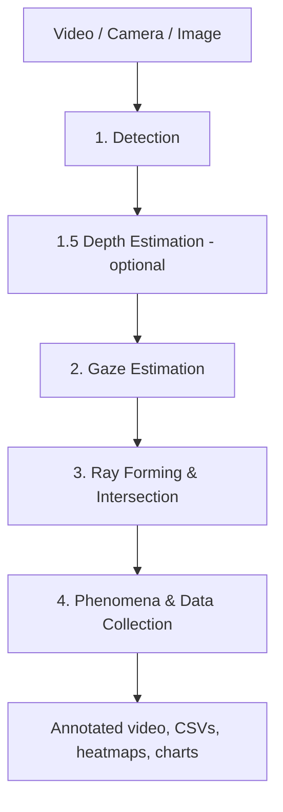

# The MindSight Pipeline

MindSight turns ordinary monocular video into structured attention data. It
takes a video file (or a live camera, or a still image), runs object detection
and gaze estimation over each frame, works out which objects each person is
looking at, and post-processes the result into tables that describe social
attention -- who looked at what, when, and together with whom. The output is
analogous to hand-coded video annotation, but produced in minutes rather than
hours and without inter-rater variability.

Everything is organised around a four-stage pipeline. Each stage feeds the
next, and most of the accuracy of a run is decided in stages 2 and 3, where raw
model output becomes "Person A is looking at Object B."

## Stage 1 -- Detection

Two detectors run on every processed frame. An object detector (YOLO for
standard object classes, or YOLOE when a study defines its own object classes
through a visual prompt) produces object bounding boxes, and a face detector
(RetinaFace) produces one bounding box per visible face. Faces are tracked
across frames so that each participant keeps a stable identity, with a
re-identification grace window that holds a track through brief occlusions or
head turns before it is dropped.

For studies whose objects of interest are not ordinary COCO classes -- a
particular toy, a specific piece of apparatus -- YOLOE lets you define the
classes visually rather than retraining a model: you show it a few reference
images with boxes drawn around your objects (a `.vp.json` visual prompt file,
built with the GUI's VP Builder tab), and it detects things that look like
them.

## Stage 1.5 -- Depth Estimation (optional)

Between detection and gaze estimation, MindSight can run a monocular depth
estimator over the frame when depth is enabled. It produces a per-pixel depth
map that later stages consult: ray forming can use it to reason about how far an
object is from a participant, sharpening the "how far" question that a flat
pitch/yaw vector cannot answer on its own. Depth runs only when configured; with
it disabled the pipeline goes straight from detection to gaze estimation, and
the rest of the run is unchanged.

## Stage 2 -- Gaze Estimation

For each tracked face, a gaze estimator predicts a direction: a pitch and yaw
describing where that person is looking. MindSight ships two families of
estimator, named here by the terms the MindSight paper uses:

- **MobileGaze** -- a fast per-face backend that produces a smooth, temporally
  consistent pitch/yaw vector for each face on every frame. It runs on Apple
  Silicon (CoreML), NVIDIA GPUs (CUDA), or CPU. It knows nothing about the
  scene -- only about the face it is given.
- **Gaze-LLE** -- a scene-aware model that processes the whole frame in a
  single forward pass and produces a gaze heatmap over the scene. It
  understands scene context but is comparatively expensive and tends to jump
  between regions rather than tracking smooth pursuit.

In the codebase and CLI these backends keep their original short names --
`MGaze` / `--mgaze-model` for MobileGaze and `Gazelle` / `--gazelle-model`,
`Weights/Gazelle/` for Gaze-LLE. The names are interchangeable; the paper names
are used throughout this documentation, and the code names appear in commands
you copy.

### Gaze-LLE Blend -- the primary operating mode

Neither estimator is ideal alone: the per-face backend is smooth but
depth-blind and scene-blind, while the scene-aware model is context-rich but
jittery and slow. **Gaze-LLE Blend** combines them and is the recommended,
most accurate way to run MindSight. A MobileGaze backend runs every frame to
supply smooth direction, and Gaze-LLE runs periodically (every *N* frames) to
supply scene-aware corrections to both the direction and the *length* of each
person's gaze ray. Blend is enabled by pointing `--rf-gazelle-model` at a
Gaze-LLE checkpoint (with `--rf-gazelle-name` selecting the model variant)
alongside a per-face pitch/yaw backend; the shipped known-good config wires both
for you.

A fixation-aware scheduler decides *when* those periodic corrections are
applied: Gaze-LLE fires only while a participant is genuinely fixating, so a
correction is never dragged onto a stale region during a head turn or smooth
pursuit. A One Euro filter then smooths the blended direction and length so the
ray does not jitter between inference calls. This blend gives you the strengths
of both models at a fraction of the cost of running the scene-aware model on
every frame. The pre-tuned values that make it work are shipped in
[`configs/pipeline_known_good.yaml`](../reference/pipeline-yaml-schema.md),
validated on classroom-style footage.

## Stage 3 -- Ray Forming and Intersection

The gaze direction from stage 2 is turned into a gaze *ray* projected into the
frame, and that ray is intersected with the object bounding boxes from stage 1
to decide which objects each participant is looking at. A hit is recorded as a
`(face_idx, object_idx)` pair for that frame.

This stage is where the raw pitch/yaw vector becomes a usable measurement, and
it is the single biggest determinant of output quality. A per-face vector alone
is 2D and depth-blind -- it says which *direction* someone is looking but not
how *far* the object is. Gaze-LLE Blend's length channel is what fixes this,
feeding scene-aware reach corrections while a participant fixates. Ray geometry
(ray length, gaze cone angle), smoothing, and the intersection logic are all
tunable; the shipped known-good config sets sensible defaults for
classroom-style footage.

A legacy mode, *Adaptive Snap*, scores nearby objects against the gaze vector
and snaps the ray to the best candidate. It works in dense scenes but needs
heavy per-study tuning and falls apart when few objects are near the task area.
Gaze-LLE Blend supersedes it for most studies.

## Stage 4 -- Phenomena and Data Collection

The per-frame hit lists feed a bank of phenomena trackers, each looking for a
specific pattern of social attention over time -- joint attention, mutual gaze,
social referencing, gaze following, gaze aversion, scanpath structure, gaze
leadership, attention span. You enable the trackers your study cares about;
each contributes its own metrics. See the [Phenomena](../phenomena/index.md)
section for what each one detects and how it is defined.

In parallel, the data-collection layer writes everything to disk: per-frame
event logs, aggregate summaries, per-participant heatmaps, time-series charts,
an annotated video, and a provenance manifest recording exactly what produced
each result. [Outputs](outputs.md) describes every file the pipeline can
produce and which ones an analyst actually needs.

## Post-processing is not optional

A recurring lesson from the MindSight paper: with post-processing disabled, raw
per-face output is essentially unusable -- set the ray short and you miss real
fixations, extend it and you accumulate false positives. The tuning of the
post-processing chain (stages 2 and 3), not the choice of backend, is the
primary determinant of output quality. The shipped known-good configuration
exists precisely so you start from a validated post-processing setup rather
than from raw defaults.
