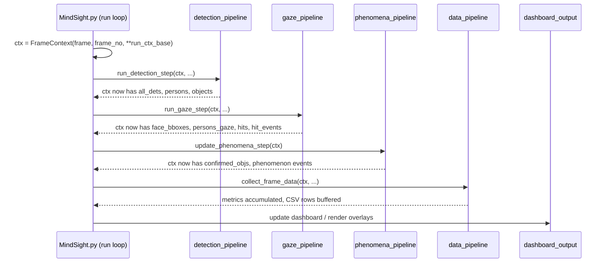

# Architecture Deep Dive

## Overview

`MindSight.py` at the repo root is a **6-line shim** — it just calls
`mindsight.cli.main`. The real orchestration lives in **`mindsight/pipeline.py`**,
which wires together four pipeline stage modules. All stages communicate through a
shared `FrameContext` (`ctx`) dict created once per frame. The orchestrator itself
contains no domain logic — it sequences the stages, manages the video capture
loop, and holds run-level state such as smoothers, trackers, and output paths.

The four stages are:

1. **Object Detection** -- detect people and objects in the frame.
2. **Gaze Tracking** -- estimate gaze rays for each detected face.
3. **Phenomena Analysis** -- derive higher-level social gaze phenomena.
4. **Data Collection** -- accumulate metrics and write outputs.

## Module Dependency Graph

```mermaid
graph TD
    MS[MindSight.py shim] --> CLI[mindsight/cli.main]
    CLI --> PL[mindsight/pipeline.py: run / process_frame]
    PL --> DP[mindsight/ObjectDetection/detection_pipeline]
    PL --> GP[mindsight/GazeTracking/gaze_pipeline]
    PL --> PP[mindsight/Phenomena/phenomena_pipeline]
    PL --> DC[mindsight/outputs/data_pipeline]

    DP --> OD[mindsight/ObjectDetection/object_detection]
    DP --> MF[mindsight/ObjectDetection/model_factory]

    GP --> GPR[mindsight/GazeTracking/gaze_processing]
    GP --> RF[mindsight/PostProcessing/RayForming/*]
    GP --> GBE[mindsight/GazeTracking/Backends/MGaze only]

    PP --> PC[mindsight/Phenomena/phenomena_config]
    PP --> PH[mindsight/Phenomena/helpers]
    PP --> PD[mindsight/Phenomena/Default/*]

    DC --> CSV[mindsight/outputs/csv_output]
    DC --> HM[mindsight/outputs/heatmap_output]
    DC --> DB[mindsight/outputs/dashboard_output]

    PL --> CFG[mindsight/pipeline_config.py]
    CLI --> FAC[mindsight/factory.build_from_namespace]
    FAC --> PLG[Plugins/__init__.py]

    PLG --> GREG[gaze_registry]
    PLG --> OREG[object_detection_registry]
    PLG --> PREG[phenomena_registry]
    PLG --> DREG[data_collection_registry]
```



`Plugins/__init__.py` provides base classes and four registries that each plugin subdirectory hooks into via a module-level `PLUGIN_CLASS` sentinel. `mindsight/pipeline_config.py` defines `FrameContext` and the configuration dataclasses consumed by every stage.

## The Orchestrator: `mindsight/pipeline.py`

### `main()` (in `mindsight/cli.py`)

Entry point behind the `MindSight.py` shim. Parses CLI arguments (each module
registers its own flags), loads an optional pipeline YAML file, calls
`factory.build_from_namespace` to wire the models, and dispatches into either
single-video mode or project mode (batch processing a directory of videos).

### `run(source, yolo, face_det, gaze_eng, ...)`

Module-level generator in `mindsight/pipeline.py` (there is also a `Pipeline`
class wrapping the same loop). It opens the video capture and creates the per-run
tracker objects that persist across frames:

- `GazeSmootherReID` — temporal smoothing of gaze rays with re-identification.
- `GazeLockTracker` — fixation lock-on / dwell detection (from `PostProcessing/RayForming/fixation.py`).
- `SnapTemporalState` — temporal snap-to-object state (from `PostProcessing/RayForming/object_snap.py`).

These are bundled into `run_ctx_base` and seeded into every `FrameContext`. The loop then iterates frames, calling `process_frame()` for each one.

### `process_frame(ctx, *, yolo, face_det, gaze_eng, ...)`

Calls the four pipeline stages in order:

1. `run_detection_step(ctx, ...)`
2. `run_gaze_step(ctx, ...)`
3. `update_phenomena_step(ctx)`
4. `collect_frame_data(ctx, ...)`

After the stages complete, the run loop handles display rendering and dashboard updates.

### `factory.build_from_namespace(ns)`

Factory function (`mindsight/factory.py`) that reads the argparse namespace and
instantiates the correct model backends (e.g., the YOLO detector, the MobileGaze
gaze engine, the Gaze-LLE blend provider) via the model factory and plugin
registries. It returns the full tuple of models + config dataclasses consumed by
`run()`.

## Pipeline Stages

| Stage | Entry Point | Module |
|-------|-------------|--------|
| Detection | `run_detection_step(ctx, ...)` | `mindsight/ObjectDetection/detection_pipeline.py` |
| Gaze | `run_gaze_step(ctx, ...)` | `mindsight/GazeTracking/gaze_pipeline.py` |
| Phenomena | `update_phenomena_step(ctx)` | `mindsight/Phenomena/phenomena_pipeline.py` |
| Data Collection | `collect_frame_data(ctx, ...)` | `mindsight/outputs/data_pipeline.py` |

Each stage reads from and writes to the `FrameContext`. See [FrameContext Reference](frame-context.md) for the full key registry.

## Configuration Hierarchy

All configuration dataclasses follow the same pattern: they are constructed via a `from_namespace(args)` class method that pulls values from the argparse namespace.

- **GazeConfig** -- ray parameters, snap distance, cone angle, smoothing window, gaze lock thresholds.
- **DetectionConfig** -- confidence threshold, COCO class IDs, blacklist labels, detection scale factor.
- **TrackerConfig** -- gaze lock frames, dwell frame count, skip frames, re-ID parameters (IoU, feature distance).
- **OutputConfig** -- save directory paths, PID map file, anonymization mode, video writer settings.
- **PhenomenaConfig** -- per-phenomenon enable/disable toggles and their individual thresholds (e.g., mutual gaze angle, joint attention confirmation frames).

All of these are defined in `mindsight/pipeline_config.py` or in their respective module configs (e.g., `mindsight/Phenomena/phenomena_config.py`).

## CLI Argument Registration

Core CLI flags are **generated from the pydantic schema** (`mindsight/config.py`). The
ordered `FlagSpec` table in `mindsight/cli_flags.py` carries each flag's presentation
(help, metavar, choices, group, order) while defaults and scalar types come from
the schema field at build time, so the schema is the single source of truth for
values. `mindsight/cli.py:_args` simply delegates to `cli_flags.parse_cli`.

```
mindsight/config.py (schema)  ─┐
mindsight/cli_flags.py         ─┴─►  build_parser()  ─►  argparse parser
Plugins (each)          ────►  add_arguments(parser)   # runtime, per plugin class
```

Plugins still register their own flags at runtime through the
`add_arguments(parser)` method on each discovered plugin class, so plugin flags
appear alongside the generated core flags (this is the v1.0 paper contract).

## Per-Frame Sequence



## GUI Architecture

The GUI is built with PyQt and lives in the `mindsight/GUI/` directory. It is a
thin consumer of the project layer (`mindsight/project/`, which holds the single
project-batch implementation: `runner.py`'s event-streaming `iter_project_runs`,
plus `events.py`, `staging.py` (RunSpec discovery + run metadata), `preflight.py`,
`ledger.py`, and the `Project` facade in `project.py`). Anything more complex than
formatting lives project-side with a fast test.

- **`main_window.py`** creates the application window with **six tabs** (in order:
  Analyze Footage, Projects, VP Builder, Inference Tuning, Models, About) plus a
  menu bar (File / View > Theme / Tools > Inference Settings / Help):
  - **Analyze Footage** (`run_study_tab.py`) -- the analysis home: a three-mode
    switch (Project / Video File / Camera), preflight checklist with fix hints, a
    runs table with ledger status and resume-plan preview, per-run re-run and
    edit-metadata actions, and a tabbed
    output panel (log, in-GUI charts, CSV viewer, and a live dashboard --
    rendered via `run_outputs.py`).
  - **Projects** (`projects_tab.py`) -- project lifecycle: the Build New Project
    wizard, session planning, Record Live Session, Crop & Adjust, and the
    project-level Study setup panel (`project_setup_panel.py`: pipeline,
    participants, conditions, output root, `project.yaml` save).
  - **VP Builder** (`vp_builder_tab.py`) -- visual prompt builder for creating,
    testing, and exporting `.vp.json` / `.vp.zip` files.
  - **Inference Tuning** (`gaze_tab/`; class `GazeTab`, so the module name lags the
    UI label) -- the decoupled parameter-tuning playground. Its panels are
    generated from the config schema's `ui` metadata: `ui_spec.py` (pure, headless)
    resolves schema fields + flag help into a spec tree and `schema_panel.py`
    renders it, including checkable toggle groups and a basic/advanced tier.
    Hand-written sections remain only for widgets the schema cannot express
    (source/model/VP pickers, backend radios, output paths). This tab is *not* the
    per-run authority — the Inference Settings dialog (`Tools` menu) is.
  - **Models** (`models_tab.py`) -- manifest-driven weight manager (install,
    verify against checksums, re-download).
  - **About** (`about_tab.py`) -- in-app documentation reader that renders bundled
    guide-card Markdown via `render_mkdocs_markdown`.

- **`workers.py`** contains `threading.Thread`-based workers that keep the UI
  responsive. `ProjectWorker` is a thin consumer of `iter_project_runs` (the same
  generator the CLI consumes) -- it translates the `ProjectEvent` stream into queue
  messages and frame previews; all discovery, ledger, and global-CSV logic lives
  in the project layer.
- **`pipeline_dialog.py`** provides import/export for pipeline YAML files; the
  export derives its sections and defaults from the config schema, so an exported
  config round-trips through `load_pipeline`.
- **`widgets.py`** supplies reusable UI components.
- **`plugin_panel.py`** renders plugin configuration controls dynamically from registered plugins.

## Plugin Integration Points

Plugins hook into four registries defined in `Plugins/__init__.py`:

| Registry | Purpose | Example |
|----------|---------|---------|
| `gaze_registry` | Alternative gaze estimation backends | Gaze-LLE (`gazelle`) |
| `object_detection_registry` | Alternative detection backends | Custom YOLO variants |
| `phenomena_registry` | New social gaze phenomena | Custom attention metrics |
| `data_collection_registry` | Custom data sinks built via `from_args` and consumed at `finalize_run` | JSON loggers, custom exports |

Auto-discovery scans `Plugins/` subdirectories at startup; each plugin module
exposes a module-level `PLUGIN_CLASS` **sentinel** that `PluginRegistry.discover()`
finds and registers — there is no per-package "registration function". Load
failures are recorded per registry (`registry.load_errors`) and surfaced loudly by
project preflight. The built-in MobileGaze backend is not discovered this way — it
is a core backend resolved directly by `gaze_factory` and does not live in a
registry. Plugins provide `add_arguments(parser)` to register CLI flags, but note
that only the gaze, object-detection, and phenomena registries are looped into the
parser in v1.0.0 — `data_collection_registry` is built via `from_args` but its
`add_arguments` is not wired (see [Plugin Base Classes](../reference/plugin-base-classes.md)).

## Auxiliary Video Streams

MindSight supports optional per-participant auxiliary video feeds (e.g., eye cameras, first-person views) that are frame-synchronised with the main source. Auxiliary streams are configured via `--aux-stream` CLI flags
(`SOURCE:VIDEO_TYPE:LABEL:PIDS`) or the `aux_streams` YAML section and are parsed
into `AuxStreamConfig` instances. Each frame, the run loop reads one frame from
every auxiliary capture and stores them in `FrameContext['aux_frames']` keyed by
the **3-tuple** `(pid, stream_label, video_type)` (`mindsight/io/sources.py:92`).
Auxiliary frames are not processed by any built-in pipeline stage but are passed to
plugins (gaze backends, phenomena trackers) for consumption via
`PhenomenaPlugin.get_aux_frame(...)`.

## Related Documentation

- [FrameContext Reference](frame-context.md)
- [Object Detection Module](object-detection-module.md)
- [Gaze Processing Module](gaze-processing-module.md)
- [Plugin System](plugin-system.md)
