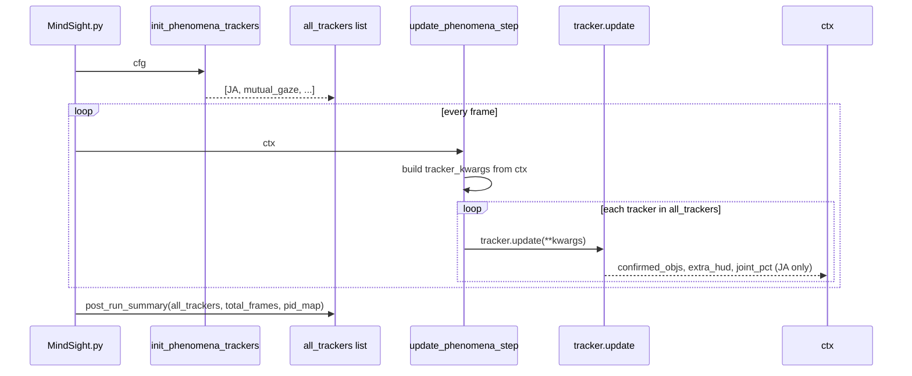

# Phenomena Engine

Developer reference for the phenomena tracking system in MindSight.

## 1. Overview

The phenomena engine is spread across three files:

| File | Role |
|---|---|
| `phenomena_pipeline.py` | Per-frame coordinator and lifecycle manager |
| `phenomena_config.py` | Configuration dataclass with all toggles and parameters |
| `helpers.py` | Shared utility functions (joint attention, gaze convergence) and the `EpisodeLog` recorder |

## 2. Phenomena Pipeline

**File:** `phenomena_pipeline.py`

### init_phenomena_trackers

```
init_phenomena_trackers(cfg: PhenomenaConfig) -> list[PhenomenaPlugin]
```

Instantiates trackers from configuration flags. Ordering is significant:

1. **JA tracker is always first** -- downstream trackers depend on `confirmed_objs` that JA produces.
2. **Left-panel trackers:** `mutual_gaze`, `social_ref`, `gaze_follow`
3. **Right-panel trackers:** `attn_span`, `gaze_aversion`, `scanpath`, `gaze_leader`

### update_phenomena_step

```
update_phenomena_step(ctx)
```

Called once per frame:

1. Builds a `tracker_kwargs` dict from the current `FrameContext`:
   - `frame_no`, `persons_gaze`, `face_bboxes`, `hit_events`, `joint_objs`, `dets`, `n_faces`, `face_track_ids`, `hits`, `tip_convergences`, etc.
2. Iterates `all_trackers` and calls `tracker.update(**tracker_kwargs)` on each.
3. The JA tracker's return dict sets `confirmed_objs`, `extra_hud`, and `joint_pct` in `ctx`.
4. Subsequent trackers see the updated `joint_objs` if JA modifies it.

### post_run_summary

```
post_run_summary(all_trackers, total_frames, pid_map)
```

Calls `console_summary()` on each tracker after video processing completes.

### finalize_trackers

```
finalize_trackers(all_trackers, frame_no)
```

Called once after the frame loop, **before** summaries are written, so each
tracker's `finalize(frame_no)` hook can close any in-flight episode (glances,
aversion streaks, mutual-gaze pairs, JA/tip spans). `frame_no` is one past the
last processed frame index. Closed episodes are what `episode_rows()` returns into
the merged `{stem}_phenomena_events.csv`.

## 3. PhenomenaConfig

**File:** `phenomena_config.py`

A dataclass holding all phenomena toggles and their parameters. `from_namespace()` constructs an instance from parsed CLI args and honours the `--all-phenomena` flag.

| Field | Type | Description |
|---|---|---|
| `joint_attention` | bool | Enable joint attention tracking |
| `ja_window` | int | Sliding window size (frames) |
| `ja_window_thresh` | float | Threshold within the JA window |
| `ja_quorum` | float | Quorum **fraction** of faces required for JA (see below); `1.0` = all faces |
| `mutual_gaze` | bool | Enable mutual gaze detection |
| `social_ref` | bool | Enable social referencing |
| `social_ref_window` | int | Social referencing window (frames) |
| `gaze_follow` | bool | Enable gaze following |
| `gaze_follow_lag` | int | Allowed lag for gaze following (frames) |
| `gaze_aversion` | bool | Enable gaze aversion detection |
| `aversion_window` | int | Aversion window (frames) |
| `aversion_conf` | float | Confidence threshold for aversion |
| `scanpath` | bool | Enable scanpath analysis |
| `scanpath_dwell` | int | Minimum dwell for scanpath fixation (frames) |
| `gaze_leader` | bool | Enable gaze leadership detection |
| `gaze_leader_tips` | bool | Use ray tips for leadership |
| `gaze_leader_tip_lag` | int | Tip lag for leadership (frames) |
| `attn_span` | bool | Enable attention span tracking |

## 4. CLI Argument Registration

Phenomena CLI flags are generated from the pydantic schema (`mindsight/config.py`) via
the `FlagSpec` table in `mindsight/cli_flags.py`, alongside every other core flag (the
old per-module `add_arguments(parser)` was removed in SP1.3).

## 5. Helper Functions

**File:** `helpers.py`

### joint_attention

```
joint_attention(persons_gaze, hits, quorum=1.0) -> set[int]
```

Returns the set of object indices under joint attention. `quorum` is a **fraction**
of the visible faces, not a raw count: an object is flagged when at least
`max(2, ceil(quorum * n_faces))` distinct faces look at it (`helpers.py:11-27`). So
`quorum=1.0` requires all faces (minimum 2), and `quorum=0.75` with 4 people
requires 3. Returns an empty set when fewer than 2 faces are present.

### gaze_convergence

```
gaze_convergence(persons_gaze, tip_radius) -> list[tuple[set, ndarray]]
```

Clusters gaze ray tips that fall within **`2 * tip_radius`** of each other
(`helpers.py:85`). Returns a list of `(face_set, centroid)` tuples, where
`face_set` is the set of participant IDs whose tips converge and `centroid` is the
cluster center. Tip convergence is itself treated as joint attention downstream (a
convergence cluster counts as a JA event even with no object under the tips).

## 6. Tracker Ordering

JA must always be the first tracker in the list because other trackers consume its `confirmed_objs` output.

Dashboard panel assignment determines display layout:

- **Left panel** trackers render in list order: mutual gaze, social referencing, gaze following.
- **Right panel** trackers render in list order: attention span, gaze aversion, scanpath, gaze leadership.

Order within each panel affects the vertical stacking of HUD elements.

## 7. Data Flow


