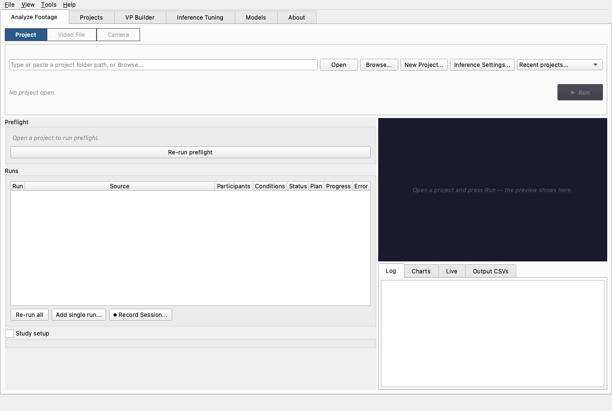
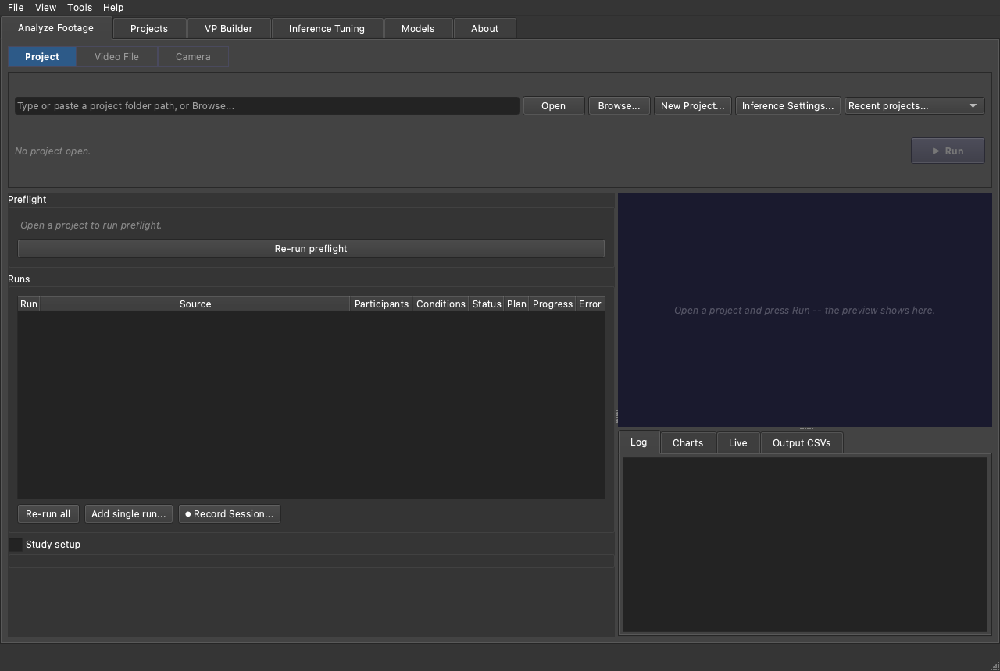

# GUI Tour

This is a five-minute orientation to the MindSight desktop app: what the six
tabs are for, what lives in the menu bar, and where to go next for each task.
It is a map, not a manual -- every surface here links to the guide that covers
it in full.

If you just want to run a study end to end, the
[Run a Study tutorial](../studies/run-a-study-tutorial.md) is the click-by-click
walkthrough. Come back here when you want to know what the *rest* of the app
does.

---

## 1. Launching MindSight

MindSight ships as a double-click installer (see
[Install](installation.md)), so after installing you launch it like any other
app:

- **macOS** -- open the **MindSight** app in your Applications folder, or the
  **MindSight** link on your Desktop.
- **Windows** -- use the **MindSight** shortcut on your Desktop or Start Menu.

From a terminal (e.g. on a shared lab machine set up by a developer) the console
command `mindsight-gui` launches the same window.

**First launch.** A fresh install seeds the shipped known-good preset,
**KG_Standard** -- the detection, gaze, and Gaze-LLE Blend settings validated on
classroom-style footage. That means the very first run you do already matches a
real study run; you do not have to configure anything to get sensible numbers.

You land on the **Analyze Footage** tab.

!!! example "🎬 Demo coming soon -- SHOT:gui-tour"
    A slow walkthrough of the whole window: the six tabs across the top, then a
    pass through the menu bar.

---

## 2. The six tabs

Across the top of the window are six tabs. You will spend almost all your time
on the first one; the rest are for occasional tasks.

**Analyze Footage** -- the home screen, and where studies actually run. A
three-way mode switch (**Project | Video File | Camera**) changes the whole tab:
open a study project and batch-process it, quick-analyze a single clip, or record
and analyze live from a webcam. See
[Analyze footage](../guides/analyze-footage.md).

=== "Light"
    

=== "Dark"
    

**Projects** -- your project library. Build a new study project with the wizard,
reopen a recent one, or review a project's runs, notes, and outputs. This is
also where you plan sessions, record live, and crop footage. See
[Projects and sessions](../guides/projects-and-sessions.md).

**VP Builder** -- build a *visual prompt*: a small `.vp.json` file that teaches
the YOLOE detector your study's objects from example images instead of class
names. See [Visual prompts](../guides/visual-prompts.md).

**Inference Tuning** -- an interactive playground for experimenting with
detection and gaze settings on a live preview. It is deliberately decoupled:
**settings here do NOT affect your study runs.** When you find values worth
keeping you import them across. See
[Inference settings and tuning](../guides/inference-settings-and-tuning.md).

**Models** -- check, verify, or re-download the model weights. The preflight
checklist on Analyze Footage uses the same manifest, so this is where you go
when preflight complains about a weight.

**About** -- program identity, links, and an in-app documentation reader (the
guides are bundled offline in the app). See
[About and theming](../guides/about-and-theming.md).

---

## 3. The menu bar

The menu bar carries the actions that are not tied to one tab:

- **File** -- **Build New Project...** (launches the wizard), **New Project...**,
  **Open Project...**, then **Load Preset...** / **Save Preset...** for named
  setting bundles, **Import Pipeline YAML...** / **Export Pipeline YAML...** to
  round-trip a full configuration as a `pipeline.yaml`, and **Quit**.
- **View > Theme** -- **Auto**, **Light**, or **Dark**. Auto follows the OS. See
  [About and theming](../guides/about-and-theming.md).
- **Tools > Inference Settings...** -- opens the Inference Settings dialog, the
  authority for how Analyze Footage runs are processed (see the callout below).
- **Help** -- **Documentation** (opens the docs site) and **About MindSight**.

!!! example "🎬 Demo coming soon -- SHOT:theme-toggle"
    View > Theme switching auto -> light -> dark, recolouring the whole window
    live.

---

## 4. Where settings live

Two surfaces touch inference settings, and it is worth learning the difference
early because it is a common source of confusion:

!!! note "The dialog governs runs; the tuning tab is a sandbox"
    - The **Inference Settings** dialog (button on every Analyze Footage mode,
      also **Tools > Inference Settings...**) is the **authority** for how runs
      launched from Analyze Footage are processed.
    - The **Inference Tuning** tab is a **decoupled playground** -- nothing you
      try there changes a study run. It is a one-way street: when an experiment
      is worth keeping, pull it into the dialog with **Import from Inference
      Tuning...**.

Every field in the dialog is documented tab by tab on the
[Inference Settings reference](../reference/inference-settings.md); the
[Inference settings and tuning guide](../guides/inference-settings-and-tuning.md)
explains the two surfaces and when to use each.

---

## 5. Where to go next

| I want to... | Go to |
|--------------|-------|
| Run a study end to end | [Run a Study tutorial](../studies/run-a-study-tutorial.md) |
| Build a project, plan and record sessions | [Projects and sessions](../guides/projects-and-sessions.md) |
| Understand the three Analyze Footage modes | [Analyze footage](../guides/analyze-footage.md) |
| Teach the detector my study's objects | [Visual prompts](../guides/visual-prompts.md) |
| Crop or re-frame recordings | [Crop and adjust](../guides/crop-and-adjust.md) |
| Change how runs are processed | [Inference settings and tuning](../guides/inference-settings-and-tuning.md) |
| Read the docs offline, switch theme | [About and theming](../guides/about-and-theming.md) |
| Find a file on disk | [Where things live](../guides/where-things-live.md) |
