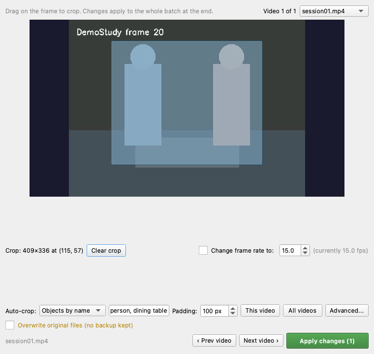
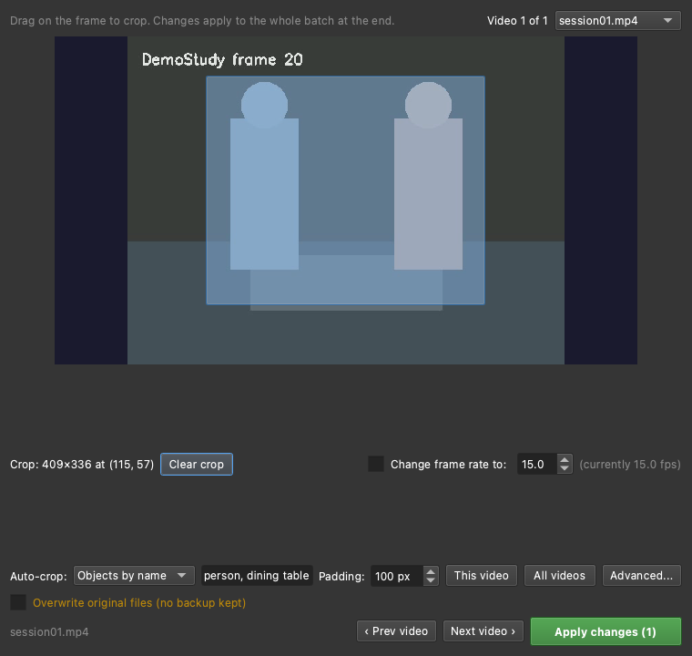

# Crop and adjust

If a camera captured more room than the study needs, or a device recorded at an
odd frame rate, **Crop & Adjust Videos...** re-frames the footage before you run
it. It is worth doing: MindSight generally performs best when the footage is
**tightly cropped to the areas that matter** -- for a desk task, the participants
and the desktop, with the feet, floor, and blank space above their heads cropped
away. Less irrelevant frame means fewer spurious detections and more resolution
spent on faces and objects.

Open it from the project overview on the **Projects** tab.

---

## Crop and re-frame

The dialog steps through the project's videos one at a time on a middle-frame
preview:

1. **Drag a rectangle** over the preview to set the crop.
2. Optionally **change the frame rate** -- tick *Change frame rate to:* and set a
   new fps (valid range **1 to 120**).
3. **Queue** the edit and step to the next video; edits accumulate across several
   videos.
4. **Apply** the whole batch in one pass.

=== "Light"
    

=== "Dark"
    

!!! example "🎬 Demo coming soon -- SHOT:crop-adjust"
    Crop & Adjust: step to a video, drag a crop rectangle, set a new fps, queue
    it, Apply to the batch.

### Non-destructive by default

Edits are **non-destructive by default**: the edited video keeps the same
filename (so `run.yaml` and run discovery never notice the swap), and the
untouched original is moved to an `original/` folder beside it. A separate,
warned **Overwrite original files** checkbox replaces the original in place with
no backup -- leave it off unless you are certain.

An edited video is picked up automatically on the next **▶ Run**: its old outputs
are archived and it reprocesses with the new picture.

---

## Auto-crop

You do not have to place the rectangle by hand. **Auto-crop** fits it around the
objects that matter:

1. Tell it what to look for -- either **YOLOE class names** (e.g.
   "person, dining table") or point it at your study's **visual prompt file**
   (see [Visual prompts](visual-prompts.md)).
2. It runs the detector on the video's middle frame, takes the **union** of all
   detections, and adds **padding**.
3. Choose whether it applies to **this video** or **all videos**.

An **Advanced...** toggle picks the detector model and sets each side's padding
independently. Padding can be **negative** -- a negative value crops *inside* the
detections rather than adding a margin.

Auto-crop **always lands the rectangle in the preview for you to review and
adjust** -- it never auto-applies. You get the final say before anything is
written.

---

## See also

- [Projects and sessions](projects-and-sessions.md) -- the project overview where
  Crop & Adjust lives.
- [Visual prompts](visual-prompts.md) -- the `.vp.json` file auto-crop can use.
- [Analyze footage](analyze-footage.md) -- running the re-framed recordings.
