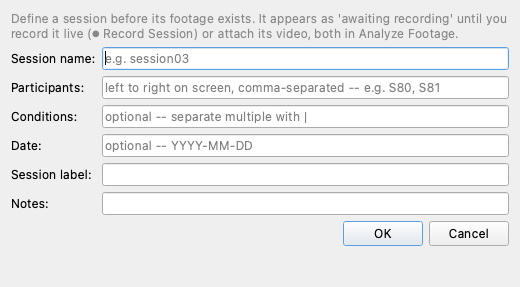
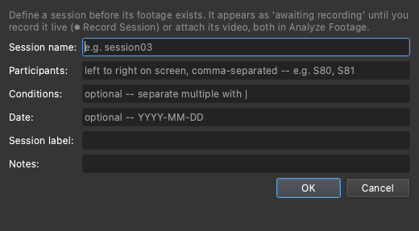
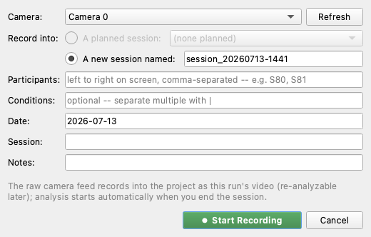
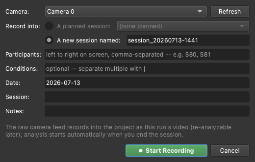

# Projects and sessions

A MindSight **project** is a folder that holds a whole study: its recordings,
each recording's participant and condition metadata, the pipeline settings the
study runs with, and every output. Working through a project (rather than
analyzing loose video files) is what gives you batch runs, resume-on-crash,
per-run metadata carried into the outputs, and the project-wide `Global_*`
aggregates.

This guide covers creating projects, the two ways footage enters a project
(planned sessions and direct adds), and managing runs. For the click-by-click
study walkthrough, see the
[Run a Study tutorial](../studies/run-a-study-tutorial.md); this guide fills in
the surrounding surfaces.

---

## Why work in a project

- **Batch runs.** One **▶ Run** processes every recording in the project.
- **Resume.** A batch keeps a ledger; if it is interrupted, starting it again
  skips what already finished (see [Run management](#run-management)).
- **Per-run metadata.** Each recording's participants and condition ride into
  the output CSVs, so aggregates and per-condition breakdowns come out for free.
- **One place for outputs.** Everything a study produces lands under the
  project's `Outputs/` folder (see [Where things live](where-things-live.md)).

---

## Create a project

There are three ways to get a project, plus a shortcut for opening one.

### Build New Project (the wizard)

**Build New Project...** -- on the Projects tab, and under the **File** menu --
assembles the folder for you in five steps:

1. **Study** -- name the project, choose where it lives, note how many people
   appear per video, and type your study's **conditions vocabulary** (the fixed
   list of experimental labels, e.g. `baseline`, `intervention`). Defining them
   here turns tagging into checkboxes later.
2. **Videos** -- add your recordings. Each gets an editable, unique **run name**
   (its folder and output name). Files are **copied** in by default (safest);
   tick *move* only if you want the originals gone. You do not need all footage
   up front -- **Add Planned Sessions...** defines future sessions now (see
   [Planned sessions](#planned-sessions)).
3. **Tag each video** -- one at a time: a middle-frame preview on the left, and
   on the right the participant fields (by on-screen position -- "Leftmost
   person", "2nd from left", ...), the condition checkboxes, and date / session
   / notes. Untagged videos are allowed (you get a warning and can fill metadata
   in later).

    

4. **Pipeline** -- pick the preset the study runs with. **KG_Standard** (the
   shipped known-good preset) is the right choice unless your study lead says
   otherwise.
5. **Review & create** -- **Create** builds the folder, stages every video into
   `Inputs/Runs/<run_id>/` with its `run.yaml`, and writes
   `Pipeline/pipeline.yaml` and `notes.md`.

When it finishes, use **▶ Open in Analyze Footage** on the project overview to
go straight to preflight.

!!! example "🎬 Demo coming soon -- SHOT:projects-wizard"
    The Build New Project wizard stepping through all five pages and Create.

### Other ways in

- **Create Blank Project** (**File > New Project...**) -- makes an empty project
  folder you populate later with **Add single run...** or by planning sessions.
- **Open an existing project** -- the Projects tab lists recent projects;
  double-click one, or **Browse...** to any folder. **File > Open Project...**
  does the same.
- **Drag a folder** onto the Analyze Footage tab -- MindSight opens it as a
  project and snaps into Project mode.

---

## Planned sessions

A **planned session** is a session that exists as metadata before its footage
does: MindSight writes the session's `run.yaml` (its participants and condition)
into `Inputs/Runs/<run_id>/` with **no video yet**. The session sits in the
project as *awaiting recording* until you fulfill it.

This is what lets a study with a known schedule (say, ten weekly sessions) do
all its metadata once, so each session day is just record-and-go.

You create planned sessions two ways:

- **In the wizard** -- **Add Planned Sessions...** on the Videos step.
- **On an existing project** -- **＋ Plan Session...** next to the runs table on
  the project's overview.

=== "Light"
    

=== "Dark"
    

!!! example "🎬 Demo coming soon -- SHOT:plan-session"
    Plan Session: name the session, set participant and condition tags, and the
    new row appears as "awaiting recording".

### Fulfilling a planned session

**Record it live.** **⏺ Record Session...** captures straight into the project:
pick the camera, pick the planned session (its tags prefill), and press
**Start Recording**. The preview shows the live feed and the status line counts
time and frames. The raw capture is written to a temporary
`Inputs/Runs/_recording_<run_id>.mp4` while recording; on **End Session** it is
moved into `Inputs/Runs/<run_id>/` like any other video and analysis starts on
it automatically.

=== "Light"
    

=== "Dark"
    

!!! example "🎬 Demo coming soon -- SHOT:record-live-session"
    Record Session: pick a camera, choose a planned session (tags prefill),
    Start, the timer ticks, End Session, auto-analysis begins.

**Attach footage recorded elsewhere.** For footage shot on another device (a
camcorder, a phone), right-click the planned session's row and choose **Attach
footage...** -- the file is copied in (your original is untouched) and MindSight
offers to analyze it.

Sessions do not have to be planned in advance: **Record Session...** can target
*a new session* named on the spot, and footage that arrives as a file goes in
through **Add single run...**. Planning ahead just means the tags are already
filled when the session day comes.

---

## The project overview

Open a project on the **Projects** tab to reach its overview: the runs table
(both real recordings and planned sessions), study notes, and shortcuts:

- **▶ Open in Analyze Footage** -- jump to preflight and running.
- **Reveal Folder** -- open the project folder in Finder / Explorer.
- **Crop & Adjust Videos...** -- re-frame or change the frame rate of recordings
  before running (see [Crop and adjust](crop-and-adjust.md)).
- **＋ Plan Session...** and **⏺ Record Session...** -- as above.
- Output shortcuts to the project's results.

---

## Run management

Once a project is open in Analyze Footage, the **Runs** table under the preflight
checklist is where you manage individual recordings.

- **Add single run...** -- add one recording at a time: pick the video, fill in
  participants (a `track:label` map, e.g. `0:P0, 1:P1`) and conditions, then
  **Run now** or **Save to project...**. **Import CSV...** loads a row from a
  `participant_ids.csv` instead of typing.

    

- **Edit run...** -- select a row to change its participants or condition after
  adding it.

    

- **Right-click a row** for its context menu: **Re-run this run** (reprocess just
  that recording; its previous output is archived, not deleted), **Record this
  session** (for a planned row), or **Attach footage...**.

Project runs **resume by default** -- **▶ Run** processes everything not already
complete and skips finished recordings. **Re-run all** (it confirms first)
reprocesses everything from scratch. Because runs resume, an interrupted overnight
batch is safe to simply start again.

---

## See also

- [Run a Study tutorial](../studies/run-a-study-tutorial.md) -- the full
  click-by-click study walkthrough, including the preflight checklist and every
  preflight message.
- [Analyze footage](analyze-footage.md) -- the three run modes in depth.
- [Crop and adjust](crop-and-adjust.md) -- re-framing recordings.
- [Where things live](where-things-live.md) -- the project folder layout on disk.
