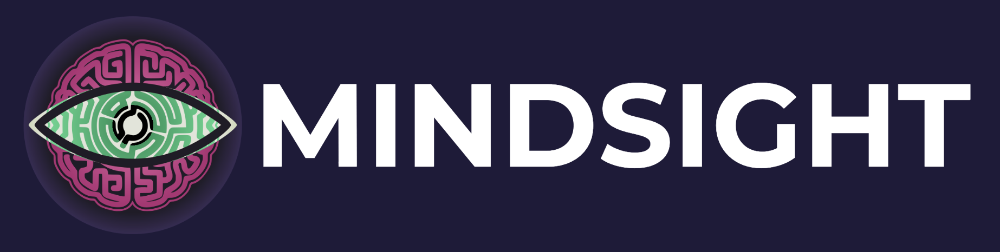

<div class="ms-hero" markdown>



# Gaze tracking for behavioral research

<p class="ms-tagline">Multi-person gaze tracking and attention analysis for behavioral research</p>

<p class="ms-version">v1.0.0 &mdash; first stable release. See the <a href="changelog.md">Changelog</a> for what shipped.</p>

<div class="ms-actions" markdown>
[Get started](getting-started/installation.md){ .ms-cta }
[Run a study tutorial](studies/run-a-study-tutorial.md){ .ms-secondary }
</div>

</div>

MindSight is an open-source toolkit that detects where people look in video, images, and live camera feeds, then maps those gaze vectors onto detected objects to identify social-cognitive phenomena such as joint attention, mutual gaze, and gaze following -- all from a single configurable pipeline.

---

## How It Works

MindSight processes each frame through a four-stage pipeline:

```text
Input (camera / video / image)
   |
   +--> Object Detection (YOLO / YOLOE)      --> object bounding boxes --.
   |                                                                     |
   +--> Face Detection (RetinaFace) --> Gaze Estimation                  |
                                        (MobileGaze / Gaze-LLE)          |
                                        --> pitch + yaw per face --.     |
                                                                   v     v
                                                       Ray-BBox Intersection
                                                                   |
                                                                   v
                                                              Hit list
                                                                   |
                                                                   v
                                          Phenomena Detection (JA, mutual gaze, ...)
                                                                   |
                                                                   v
                                     Data Collection (CSV, heatmaps, dashboard)
```

1. **Object & Face Detection** -- locates people, faces, and objects of interest in every frame.
2. **Gaze Estimation** -- predicts a 3-D gaze direction (pitch and yaw) for each detected face.
3. **Ray-BBox Intersection** -- casts each gaze ray and determines which bounding boxes it hits.
4. **Phenomena & Data Collection** -- classifies social-gaze events and writes structured output.

---

## Feature Highlights

### Core Functionality

- Frame-by-frame gaze-to-object intersection via ray casting
- Swappable object-detection backends (YOLO, YOLOE with visual prompts)
- Swappable gaze-estimation backends (MobileGaze, Gaze-LLE)
- Face anonymization for privacy-sensitive recordings
- Auxiliary video stream support for multi-camera setups
- CLI and GUI interfaces for flexible workflows
- YAML-driven pipeline configuration

### Phenomena Tracking

- **Joint Attention** -- two or more people attending to the same object
- **Mutual Gaze** -- two people looking at each other
- **Social Referencing** -- gaze shifts toward a reference person after an event
- **Gaze Following** -- one person's gaze directing another's
- **Gaze Aversion** -- active avoidance of eye contact
- **Scanpath Analysis** -- sequential fixation patterns over time
- **Gaze Leadership** -- identifying who initiates gaze shifts in a group
- **Attention Span** -- sustained fixation duration on targets

### Extensibility

- Plugin architecture for custom gaze backends, detectors, and phenomena
- Drop-in plugin discovery -- add a folder, register in YAML, run
- Base classes and hooks for every pipeline stage

### Research Tools

- Per-frame CSV export with full gaze and detection metadata
- Aggregated heatmap generation over configurable time windows
- Live dashboard with real-time gaze overlay
- Project mode for batch processing of multiple videos

---

## Where to Start

**For researchers**

Get MindSight running, process your first video, and explore the phenomena it can detect.

- [Getting Started](getting-started/index.md) -- installation and first run
- [Understand the Pipeline](concepts/pipeline.md) -- the four-stage pipeline and Gaze-LLE Blend
- [Phenomena](phenomena/index.md) -- detailed descriptions of each tracked phenomenon

**For developers**

Understand the internals, write plugins, and extend the pipeline.

- [Architecture Deep Dive](developer/architecture.md) -- how the pipeline fits together
- [Plugin System](developer/plugin-system.md) -- extension points and base classes
- [Developer Guide](developer/index.md) -- module references and contribution guidelines

<!-- screenshot: MindSight GUI main window -->
