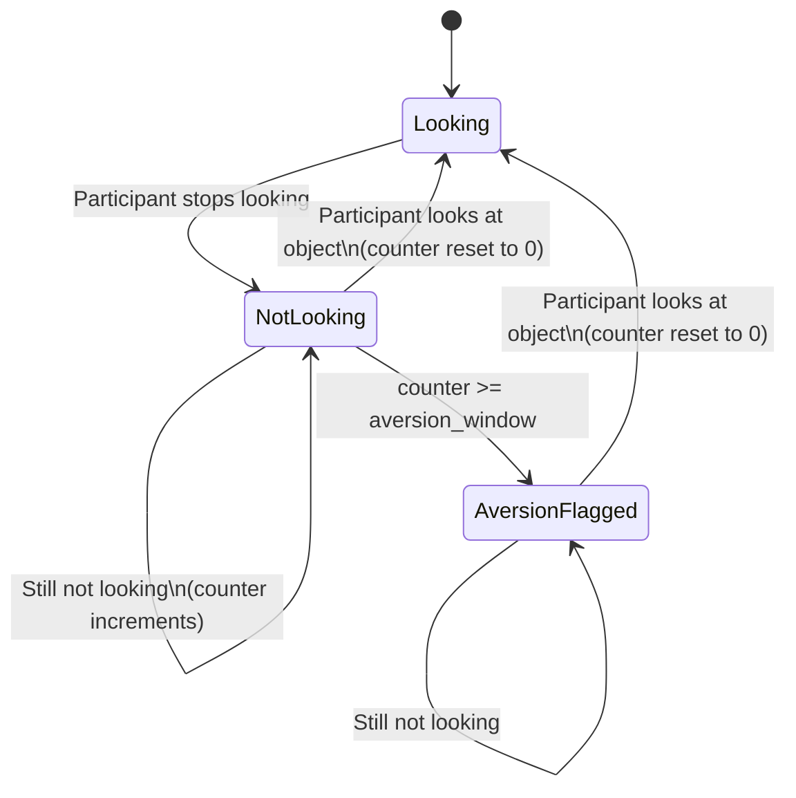

# Gaze Aversion

## What It Is

Gaze aversion occurs when a participant consistently fails to look at a visible, salient object for an extended period. It captures sustained avoidance of specific objects or regions, distinguishing deliberate or involuntary avoidance from momentary inattention by requiring the absence to persist across a configurable frame window.

## Research Context

Gaze aversion is studied extensively in social anxiety research, autism spectrum disorder assessments, phobia studies, and avoidance behavior paradigms. Measuring what participants do not look at can be as informative as measuring what they do look at, revealing discomfort, fear, or disinterest toward specific stimuli.

## How MindSight Detects It

The algorithm tracks consecutive non-looking frames for each participant-object pair:

1. For each `(face_idx, object_class)` pair every frame:
   - If the participant **is** looking at the object, reset the consecutive no-look counter to 0.
   - If the participant is **not** looking, increment the counter.
2. When the counter reaches or exceeds `aversion_window` frames, flag the pair as an active aversion.
3. Only objects detected above `aversion_conf` confidence threshold are considered, filtering out low-confidence detections.
4. Object class names (not per-frame indices) are used to survive object-index churn across frames.



## Parameters

| Parameter | Type | Default | Description |
|---|---|---|---|
| `--gaze-aversion` | flag | disabled | Enable gaze aversion detection |
| `--aversion-window` | int | 60 | Number of consecutive non-looking frames required to flag aversion |
| `--aversion-conf` | float | 0.5 | Minimum object detection confidence to consider the object as present |

## Output

An *aversion episode* opens when the no-look counter first crosses
`aversion_window` (anchored back to the frame the streak began) and closes when
the participant next looks at that object or the run ends. The summary aggregates
these completed episodes per `(participant, object)`.

**Summary CSV** (`{stem}_summary.csv`, `phenomenon = gaze_aversion`). Four
metrics per participant-object pair:

```
video_name,conditions,phenomenon,participant,partner,object,metric,value
,,gaze_aversion,P0,,knife,episode_count,3
,,gaze_aversion,P0,,knife,frames_active,214
,,gaze_aversion,P0,,knife,seconds_active,7.133
,,gaze_aversion,P0,,knife,pct_of_video,11.8889
```

**Episode stream** (`{stem}_phenomena_events.csv`): each resolved aversion
episode is logged as one `gaze_aversion` row with its frame/second bounds and
duration.

**Dashboard**: A "GAZE AVERSION" panel displays active aversions such as
`P0 avoids knife`.

**Console**: Nothing -- this tracker prints no post-run console summary.

**Time-series**: Plots the count of currently active aversions over time.

## Example

```bash
python MindSight.py --source video.mp4 --gaze-aversion --aversion-window 90
```

## Related Phenomena

- [Attention Span](attention-span.md) -- complementary measure of sustained looking
- [Scanpath](scanpath.md) -- aversion manifests as absence from the fixation sequence

## Source

`mindsight/Phenomena/Default/gaze_aversion.py`
