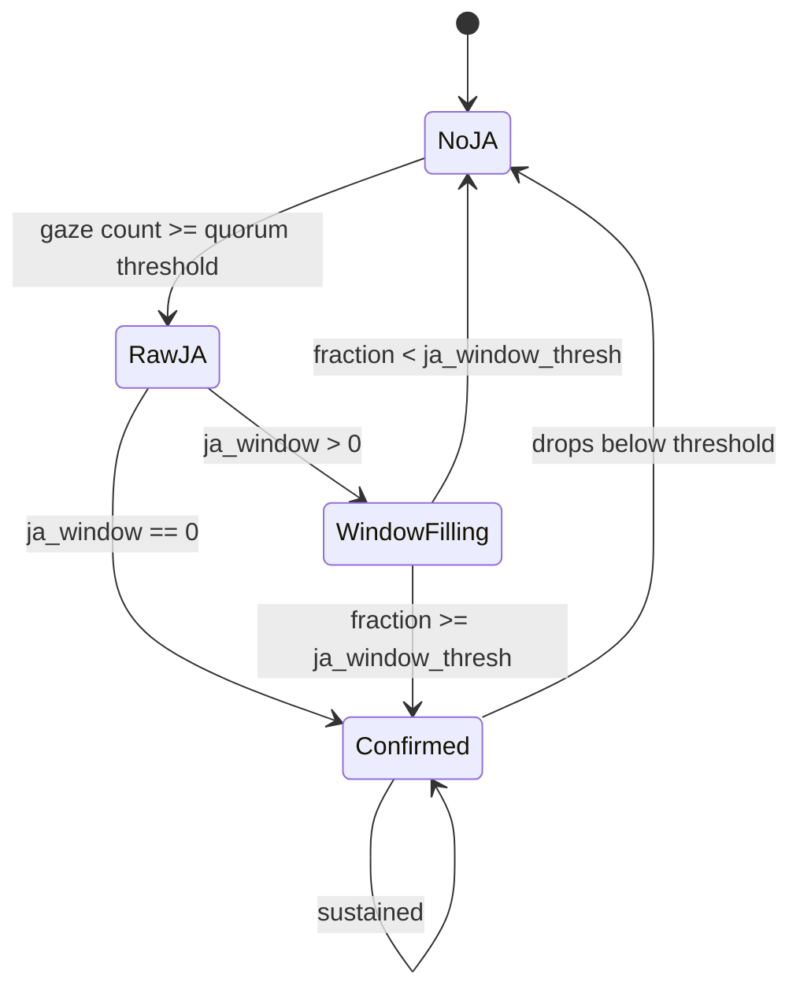

# Joint Attention

**Source:** `mindsight/Phenomena/Default/joint_attention.py`

## What It Is

Joint attention occurs when multiple participants simultaneously fixate on the same object. It is one of the most widely studied gaze phenomena because it reflects shared intentionality -- the ability of two or more people to coordinate their visual attention on a common target. MindSight detects joint attention on a per-object, per-frame basis and reports running percentages over the session.

## Research Context

Joint attention is a foundational milestone in early cognitive development and is routinely assessed in developmental psychology and ASD (Autism Spectrum Disorder) screening. Researchers study it to understand how infants learn to share attention with caregivers, how social cognition emerges, and how breakdowns in joint attention relate to developmental differences. It is also relevant in collaborative work, education, and human-robot interaction research.

## How MindSight Detects It

The detection algorithm has three stages:

1. **Raw JA detection.** For every detected object in the current frame, count how many faces have a gaze ray that intersects that object's bounding region. If the count is greater than or equal to `ceil(quorum * n_faces)` and there are at least 2 faces in the scene, the object is flagged as under raw joint attention.

2. **Temporal filtering (optional).** When `--ja-window` is set to a value greater than 0, a sliding window of that many frames is maintained per object. An object's joint attention is confirmed only if it appeared in the raw JA set for at least `ja_window_thresh` fraction of the frames in the window. This smooths out momentary flickers.

3. **Running percentage.** MindSight tracks `confirmed_frames / total_frames` as a running JA percentage over the entire session -- an aggregate across the whole scene, not per object.

4. **Union with gaze-tip convergence.** Joint attention is the **union** of object-based JA and gaze-tip convergence (the per-frame ruling in the pipeline). When `--gaze-tips` is enabled, MindSight also detects moments where two or more participants' gaze rays converge on the same point in space even if no detected object sits there. A frame counts as joint attention if it has object JA, tip convergence, or both -- the two modes are never double-counted within a frame. Tip convergence is *also* tallied on its own so the summary can report it as a visible breakdown (`phenomenon = tip_convergence`).



## Parameters

| Flag | Type | Default | Description |
|---|---|---|---|
| `--joint-attention` | bool | `False` | Enable joint attention tracking |
| `--ja-window` | int | `0` | Sliding window size in frames for temporal filtering. 0 disables the filter. |
| `--ja-window-thresh` | float | `0.70` | Fraction of window frames an object must appear in raw JA to be confirmed |
| `--ja-quorum` | float | `1.0` | Fraction of visible faces that must fixate on an object for raw JA (1.0 = all faces) |
| `--all-phenomena` | bool | `False` | Enable all phenomena including joint attention |

## Output

**Summary CSV** (`{stem}_summary.csv`, `phenomenon = joint_attention`). The
metric is aggregate, scoped to `participant = all`:

- `frames_active` -- number of confirmed-JA frames
- `seconds_active` -- the same converted to seconds
- `pct_of_video` -- confirmed frames as a percentage of total frames

When gaze-tip convergence occurred, a second block of rows is emitted under
`phenomenon = tip_convergence` with the same three metrics. Example rows
(single-video mode, leading `video_name,conditions` columns blank):

```
video_name,conditions,phenomenon,participant,partner,object,metric,value
,,joint_attention,all,,,frames_active,842
,,joint_attention,all,,,seconds_active,28.067
,,joint_attention,all,,,pct_of_video,46.7813
,,tip_convergence,all,,,frames_active,120
,,tip_convergence,all,,,pct_of_video,6.6667
```

**Episode stream** (`{stem}_phenomena_events.csv`): each confirmed object-JA
span is logged as one `joint_attention` row (`object` = the class, `participant`
= `all`), and each tip-convergence span as one `tip_convergence` row
(`participant` = the converging set, e.g. `P0+P1`), both with frame/second
bounds and a duration.

**Dashboard:**
A "JOINT ATTENTION" panel listing objects currently under joint attention
alongside the running aggregate JA percentage.

**Console:**
One aggregate line for raw JA (`joint_frames / total`), plus a confirmed line
when a temporal window is active -- not a per-object breakdown.

## Example

```bash
python MindSight.py --source video.mp4 --joint-attention --ja-window 10
```

This enables joint attention detection with a 10-frame sliding window. An object must appear in raw JA in at least 70% of the window (the default threshold) to be confirmed.

## Related Phenomena

- [Gaze Leadership](gaze-leadership.md) -- identifies who initiates joint attention episodes
- [Gaze Following](gaze-following.md) -- captures sequential (rather than simultaneous) shifts of attention toward a shared target
