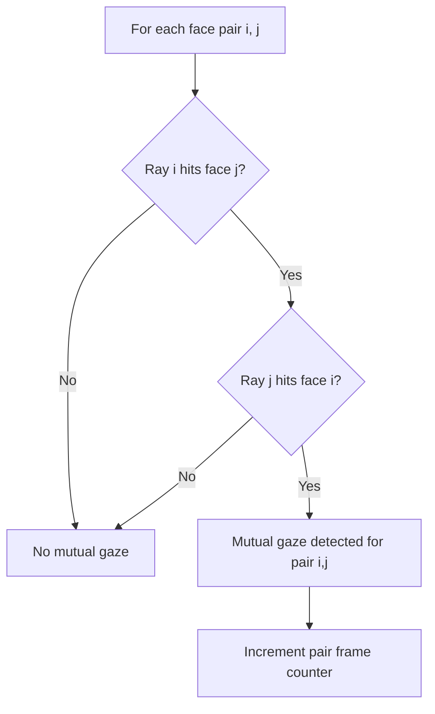

# Mutual Gaze

**Source:** `mindsight/Phenomena/Default/mutual_gaze.py`

## What It Is

Mutual gaze (eye contact) occurs when two participants are looking directly at each other at the same time. It is one of the most fundamental social signals in face-to-face interaction. MindSight detects mutual gaze on a per-pair, per-frame basis using bidirectional ray-to-face intersection tests.

## Research Context

Mutual gaze is studied across social cognition, developmental psychology, and conversational analysis. It plays a central role in social bonding, turn-taking regulation during conversation, and the establishment of shared intentionality. Researchers measure its frequency, duration, and timing to understand interpersonal dynamics in contexts ranging from parent-infant interaction to clinical interviews.

## How MindSight Detects It

For every unique pair of detected faces (i, j) in each frame:

1. Cast person i's gaze ray and test whether it intersects person j's face bounding box using Liang-Barsky ray-AABB intersection.
2. Cast person j's gaze ray and test whether it intersects person i's face bounding box.
3. If both intersections succeed in the same frame, mutual gaze is recorded for that pair.

The detection scope respects the `--detect-extend` flag, which controls how far gaze rays extend for phenomena-level intersection tests.



## Parameters

| Flag | Type | Default | Description |
|---|---|---|---|
| `--mutual-gaze` | bool | `False` | Enable mutual gaze tracking |
| `--all-phenomena` | bool | `False` | Enable all phenomena including mutual gaze |

## Output

**Summary CSV** (`{stem}_summary.csv`, `phenomenon = mutual_gaze`). One tidy row
per metric per pair, with the pair carried in `participant` and `partner`:

```
video_name,conditions,phenomenon,participant,partner,object,metric,value
,,mutual_gaze,P0,P1,,frames_active,315
,,mutual_gaze,P0,P1,,seconds_active,10.500
,,mutual_gaze,P0,P1,,pct_of_video,17.5000
```

**Episode stream** (`{stem}_phenomena_events.csv`): each contiguous mutual-gaze
span for a pair is logged as one `mutual_gaze` row (`participant`/`partner` = the
two members) with frame/second bounds and a duration.

**Dashboard:**
A "MUTUAL GAZE" panel displaying currently active pairs (e.g., "P0 <-> P1") in
real time.

**Console:**
Per-pair frame counts and percentages printed at the end of the session.

## Example

```bash
python MindSight.py --source video.mp4 --mutual-gaze
```

This enables mutual gaze detection with default settings. Every frame where two participants are looking at each other is counted and reported.

## Related Phenomena

- [Social Referencing](social-referencing.md) -- builds on face-directed gaze as the first step before redirecting to an object
- [Gaze Following](gaze-following.md) -- tracks sequential gaze shifts between participants
