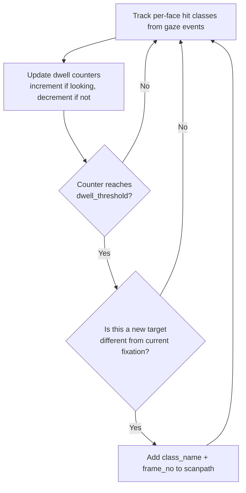

# Scanpath Analysis

## What It Is

Scanpath analysis records the ordered sequence of fixation targets for each participant. A fixation is confirmed when a participant dwells on the same object class for a configurable number of consecutive frames, filtering out transient glances and capturing deliberate visual attention shifts.

## Research Context

Scanpath analysis is used in visual search strategy research, expertise studies, reading pattern analysis, and comparative viewing behavior experiments. By capturing the order in which participants inspect objects, researchers can identify systematic exploration strategies, compare novice versus expert scanning patterns, and quantify differences in viewing behavior across conditions or groups.

## How MindSight Detects It

The algorithm uses dwell-based fixation detection per participant:

1. For each `(face_idx, object_class)` pair, maintain a dwell counter:
   - If the participant **is** looking at that class, increment the counter.
   - If **not** looking, decrement the counter (minimum 0, then remove the entry).
2. When a counter reaches exactly `dwell_threshold` **and** the class is a new fixation target (different from the participant's current fixation), record it in the scanpath.
3. Each participant accumulates an ordered list of `(class_name, frame_no)` entries representing their fixation sequence.



## Parameters

| Parameter | Type | Default | Description |
|---|---|---|---|
| `--scanpath` | flag | disabled | Enable scanpath recording |
| `--scanpath-dwell` | int | 8 | Number of consecutive frames of dwell required to confirm a fixation |

## Output

**Summary CSV** (`{stem}_summary.csv`, `phenomenon = scanpath`). A single scalar
per participant -- the total number of confirmed fixations:

```
video_name,conditions,phenomenon,participant,partner,object,metric,value
,,scanpath,P0,,,fixation_count,3
```

**Scanpath stream** (`{stem}_scanpath.csv`): the ordered fixation sequence, one
row per fixation. `fixation_index` is that participant's 0-based fixation order:

```
video_name,conditions,participant,fixation_index,object
,,P0,0,knife
,,P0,1,cup
,,P0,2,plate
```

In project mode these stack into `Global_scanpath.csv`. The scanpath tracker
records no episodes, so it does not contribute to `{stem}_phenomena_events.csv`.

**Dashboard**: A "SCANPATH" panel shows the last few fixations per participant in
the format `P0: knife->cup->plate`.

**Console**: Nothing -- this tracker prints no post-run console summary.

**Time-series**: Plots total fixation count over time.

## Example

```bash
python MindSight.py --source video.mp4 --scanpath --scanpath-dwell 12
```

## Related Phenomena

- [Attention Span](attention-span.md) -- measures dwell duration on individual targets
- [Gaze Aversion](gaze-aversion.md) -- objects absent from the scanpath may indicate avoidance

## Source

`mindsight/Phenomena/Default/scanpath.py`
