# Run a Study with MindSight

This is a start-to-finish walkthrough for a research assistant who has been
handed a set of recordings and asked to run them through MindSight. It assumes
**no prior experience** with the command line -- every step is a click in the
app.

The guide is deliberately generic. Wherever it says *your study* or *your study
lead*, fill in the specifics your lab gave you. The concrete example it points
at is the `Projects/ExampleStudy/` folder that ships with MindSight and the
shipped preset `configs/pipeline_known_good.yaml` -- use them as a reference for
the shape of a real project.

!!! note "What you need before you start"
    - MindSight installed (below).
    - The **study project folder** your study lead prepared, or the videos plus
      the participant/condition scheme to build one.
    - A rough idea of your study's *conditions* (the experimental labels for each
      recording) and *participants* (who is in each recording).

---

## 1. Install MindSight

MindSight ships as a double-click installer that sets up a private Python, all
of MindSight's dependencies, and the four required model weights (about 115 MB).
You do not need to install anything else first -- no Python, no packages.

=== "macOS"

    1. Download the release zip (for example `MindSight-1.0.0-mac.zip`) from the
       lab's release location. *(Download links go live once the first tagged
       release is published; until then your study lead will hand you the zip.)*
    2. Double-click the zip in Finder to extract it, then move the extracted
       folder somewhere you can find again (Desktop or Downloads is fine).
    3. Open the extracted folder. **Right-click** (or Control-click)
       `Install-MindSight.command` and choose **Open**.
    4. macOS Gatekeeper may warn that the file is from an unidentified developer.
       Because you used **right-click > Open**, the dialog gives you an **Open**
       button -- click it. (A plain double-click only offers *Move to Trash*;
       right-click > Open is how you get past it. This is expected for an
       in-house tool that is not code-signed.)
    5. A Terminal window opens and walks through six steps, printing a line for
       each. Leave it running -- installing dependencies and downloading the
       weights takes several minutes. It finishes with either
       `MindSight install: PASS` or `MindSight install: FAILED at step N`.
    6. Press Return to close the window.

    The installer creates a **MindSight** app in your Applications folder and a
    matching **MindSight** link on your Desktop. Open either one to launch the
    app. The first launch may prompt Gatekeeper once more -- use
    **right-click > Open** that one time.

    Everything lives under `~/MindSight` (your home folder's `MindSight`
    directory). Your results are written inside `~/MindSight/app/Outputs/`.

    *(Screenshots of the macOS Finder / Gatekeeper / Terminal install steps are
    to follow. The wording above matches exactly what you will see.)*

=== "Windows"

    1. Download the release zip (for example `MindSight-1.0.0-win.zip`).
       *(Download links go live once the first tagged release is published.)*
    2. Right-click the zip, choose **Extract All...**, and extract it to a folder
       you can find again.
    3. Open the extracted folder and double-click **`Install-MindSight.bat`**.
    4. Windows may show a blue **"Windows protected your PC"** SmartScreen box
       because the installer is unsigned. Click **More info**, then **Run
       anyway**. (This is expected for an in-house tool.)
    5. A console window walks through seven steps. Leave it running; it finishes
       with `MindSight install: PASS` or `MindSight install: FAILED at step N`.
    6. Press a key to close the window.

    Launch MindSight from the **MindSight** shortcut on your Desktop or Start
    Menu. Everything lives under `%LOCALAPPDATA%\MindSight` (usually
    `C:\Users\<you>\AppData\Local\MindSight`); results land in
    `...\MindSight\app\Outputs\`.

    *(Windows install screenshots are to follow; the SmartScreen wording above is
    exactly what appears.)*

If your lab set you up on a shared lab machine that already has MindSight, skip
this section -- just open the app.

---

## 2. The home screen

When MindSight opens you land on the **Analyze Footage** tab. At the top of the
tab is a three-way mode switch -- **Project | Video File | Camera** -- and the
whole tab changes with it:

- **Project** -- open a study project, read its preflight checklist, and run the
  whole batch. This is where you spend almost all of your time.
- **Video File** -- analyze a single video without any project. Good for a quick
  look at one recording.
- **Camera** -- record and analyze live from a webcam.

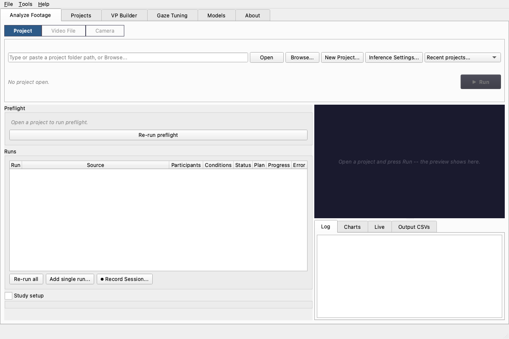

The other tabs are for occasional tasks:

- **Projects** -- your project library: build a new study project with the
  wizard, reopen a recent one, or review a project's runs, notes, and outputs.
- **VP Builder** -- make a visual prompt (teaches the detector your study's
  objects).
- **Inference Tuning** -- an interactive playground for experimenting with
  gaze settings on a live preview. *Settings here do NOT affect your study
  runs* -- those come from the project's pipeline preset and the **Inference
  Settings** dialog (see the appendix).
- **Models** -- check, verify, or re-download the model weights.

---

## 3. Open the study project folder

A MindSight *project* is just a folder with a known layout. Your study lead most
likely handed you one already; if so, that folder is your starting point.

Any of these opens it -- use whichever is closest to hand:

- **Projects tab** -- your library lists recent projects with their run counts;
  double-click one, or **Browse...** to any folder.
- **Analyze Footage, Project mode** -- **Browse...**, paste a path and press
  **Open**, or pick from the **Recent projects...** dropdown.
- **File menu** -- **Open Project...**.
- **Drag and drop** -- drop the project folder anywhere onto the Analyze
  Footage tab.

Opening a project snaps Analyze Footage into Project mode with that project
loaded.

The example project that ships with MindSight, `Projects/ExampleStudy/`, shows
the shape a project takes:

```
ExampleStudy/
├── project.yaml            # points at the pipeline preset; holds participants/conditions
├── notes.md                # free-form study notes (shown on the Projects tab)
├── Pipeline/
│   └── pipeline.yaml       # the pipeline preset this study runs with
├── Inputs/
│   ├── Runs/               # one subfolder per recording session (run-folder layout)
│   ├── Videos/             # (legacy flat layout) recordings directly in a folder
│   └── Prompts/            # your study's .vp.json visual prompt, if you use one
└── Outputs/                # created for you when you Run
```

The pipeline preset is MindSight's pre-tuned known-good configuration:
detection, gaze, and **Gaze-LLE Blend** settings validated on classroom-style
footage. You normally never touch it -- the wizard writes it for you, or your
study lead has already pointed the project at the right one.

A project uses **one of two layouts** for its recordings:

- **Run-folder layout** -- each recording session gets its own folder under
  `Inputs/Runs/<run_id>/` holding exactly one video plus a `run.yaml` with that
  session's participants and condition. This is what the wizard builds, and the
  layout every new study should use.
- **Flat layout** (legacy) -- videos sit directly in `Inputs/Videos/`. Still
  supported for older projects.

Do not mix both in one project -- preflight will stop you if a project has
videos in both places.

---

## 4. Build a project with the wizard

If your study lead handed you a finished project folder, skip to
[preflight](#5-read-the-preflight-checklist). If you have loose recordings and
a study scheme, the **Build New Project...** wizard on the Projects tab (also
under **File**) assembles the folder for you in five steps:

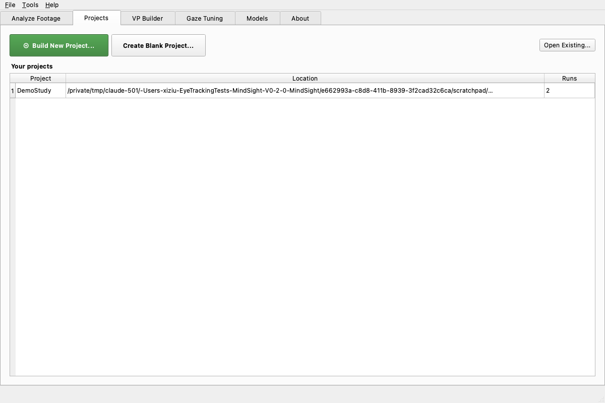

1. **Study** -- name the project, choose where it lives, note how many people
   appear per video, and type your study's **conditions vocabulary** (the fixed
   list of experimental labels, e.g. `baseline`, `intervention`). Defining them
   here turns the tagging step into simple checkboxes.
2. **Videos** -- add your recordings. Each gets an editable, unique **run name**
   (this becomes its folder and output name). Files are **copied** into the
   project by default (safest); tick *move* only if you want the originals
   gone from their old location.

    You do not need all the footage up front. **Add Planned Sessions...**
    defines future sessions now -- name them and take their participant and
    condition tags in the tagging step like any other video -- and they sit in
    the project as *awaiting recording* until the day you record them live or
    attach their footage (see [recording sessions](#record-a-session-live)).
    If your study has a known schedule (say, ten weekly sessions), planning
    them all at creation time means the metadata is done once and each
    session day is just record-and-go.
3. **Tag each video** -- one video at a time: a middle-frame preview on the
   left, and on the right the participant fields ("Leftmost person",
   "2nd from left", ... -- type each person's ID by their on-screen position),
   the condition checkboxes, and date / session / notes (the date is prefilled
   from the file). Untagged videos are allowed -- you get a warning, and can
   fill metadata in later.

4. **Pipeline** -- pick the preset the study runs with. **KG_Standard** (the
   shipped known-good preset) is the right choice unless your study lead says
   otherwise.
5. **Review & create** -- a summary of everything; **Create** builds the
   folder, stages every video into `Inputs/Runs/<run_id>/` with its
   `run.yaml`, and writes `Pipeline/pipeline.yaml` and `notes.md`.

When it finishes, use **▶ Open in Analyze Footage** on the project overview to
go straight to preflight.

---

## 5. Read the preflight checklist

Every time you open a project (and again whenever you click **Re-run
preflight**) MindSight runs a **preflight** check: a readiness checklist that
catches the common problems *before* you spend hours processing. Green checks
are fine, yellow are warnings you can usually ignore, red are things you must
fix.

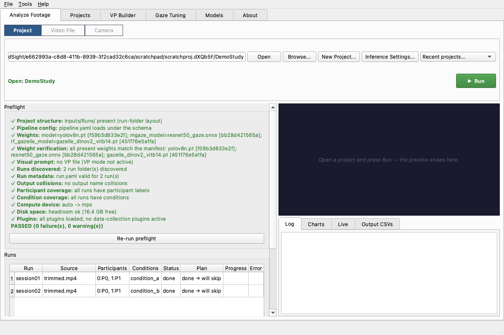

A healthy project reads **PASSED**, possibly with a warning or two (missing
participant labels and low disk are warnings, not blockers). If preflight shows
a red **FAIL**, do not press Run -- find the row in the
[troubleshooting table](#11-troubleshooting-every-preflight-message) at the
bottom of this page, which explains every preflight message in plain language
and who to call.

Below the checklist, the **Runs** table lists every recording MindSight found,
one row each, with its participants, condition, current status, and what Run
will do to it (process it, or re-run and archive the previous output). Planned
sessions that have no footage yet show as *awaiting recording*.

Everything in the left column -- preflight, the runs table, and the **Study
setup** panel -- scrolls together if it outgrows the window.

---

## 6. Add, edit, record

If the project already has its videos and metadata, skip ahead to
[Run](#7-run-the-analysis). These are the controls under the **Runs** table for
everything else.

### Add a recording

Click **Add single run...** to add one recording at a time. Pick the video with
**Browse...**, then fill in the fields:

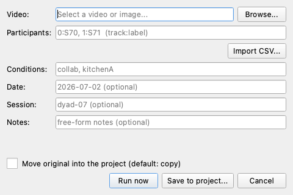

- **Participants** -- a `track:label` map, e.g. `0:P0, 1:P1`. The number is the
  detected face's tracking id; the label is your name for that person. Leave it
  blank and MindSight defaults to `P0, P1, ...`.
- **Import CSV...** -- if your study keeps a `participant_ids.csv`, load a row
  from it instead of typing.
- **Conditions** -- the experimental condition tag(s) for this recording, e.g.
  `condition_a`. These become a column in the outputs and drive the
  per-condition aggregates.
- **Date / Session / Notes** -- optional bookkeeping.
- **Move original into the project** -- leave unchecked to copy the video in
  (the default, and safest); check it to move the file instead, so the original
  leaves its old location.

Click **Run now** to process immediately, or **Save to project...** to add it
and run everything later.

### Edit a recording's metadata

To change a recording's participants or condition after adding it, select its
row and use **Edit run...**:

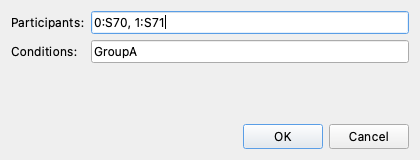

### Record a session (live)

If your study records participants live at the computer, **⏺ Record
Session...** captures straight into the project: pick the camera, pick (or
name) the session -- planned sessions prefill their tags -- and press Start.
The preview shows the live feed and the status line counts time and frames.
Press **End Session** to stop: the raw recording is staged into
`Inputs/Runs/<run_id>/` like any other video and analysis starts on it
automatically.

To use footage recorded on another device (a camcorder, a phone), right-click
the planned session's row and choose **Attach footage...** -- the file is
copied in (your original is untouched) and MindSight offers to analyze it.

Sessions do not have to be planned in the wizard: for an existing project,
**＋ Plan Session...** (next to the runs table on the project's Projects-tab
overview) adds a future session -- name and tags now, footage later. And
unplanned sessions land just as easily: **⏺ Record Session...** can target
*a new session* named on the spot, and footage that arrives as a file goes in
through **Add single run...**. Planning ahead just means the tags are already
filled in when the session day comes.

### Study-wide settings

Study-wide settings -- the pipeline preset in use, the project-wide
participant map, and per-video conditions -- are edited on the **Projects**
tab: open your project's overview, expand **Study setup**, and press
**Save project.yaml**. To de-identify outputs (blur or black out faces in
the annotated video and heatmap backgrounds -- e.g. when your ethics
protocol requires it), turn on **Anonymize faces** in the **Inference
Settings...** dialog; like every processing option, it applies to any run
you launch until you turn it off.

---

## 7. Run the analysis

When preflight passes and the runs table looks right, press the green **▶ Run**
button on the project card at the top of the tab. It turns into a red **Stop**
while the batch is live. MindSight processes each recording in turn.

**What normal progress looks like.** The preview pane shows the annotated video
as it processes, and the **Log** panel prints a line-by-line trace: it loads
the models (you will see the **MobileGaze** gaze backend and the **Gaze-LLE**
scene model come up), then reports per-frame progress, then a `Done` line per
video with the frame count and how many gaze-object hit events it recorded.
The runs table fills in as each video completes.

**How long it takes.** Expect each video to take from about its own duration up
to several times longer, depending heavily on the machine and on whether the
annotated video is being rendered (rendering is the slowest output by far). As a
rough anchor, a short clip runs in a few minutes on Apple Silicon; a full
30-minute session can take substantially longer, especially on a CPU-only
machine. **Treat a full study batch as an overnight job**: start it at the end of
the day, leave the machine awake and plugged in, and check it in the morning. If
it is interrupted, MindSight resumes where it left off (see
[section 9](#9-re-run-one-failed-video)) -- you will not lose completed work.

You can press **Stop** to halt after the current frame; already-completed videos
keep their outputs. If you try to quit mid-run, MindSight asks first -- choosing
**Yes** stops cleanly and finishes writing the current video's summary before
closing, so you never end up with a half-written output.

---

## 8. Outputs and what to hand the analyst

When a batch finishes, its results are under the project's `Outputs/` folder.
You can inspect them without leaving the app:

- The **Charts** tab (in the output panel, bottom right) shows the phenomena
  charts for a selected run -- a quick visual sanity check.

  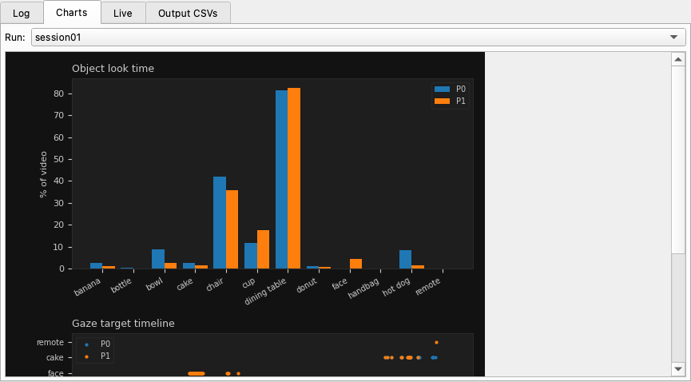

- The **Output CSVs** tab is a read-only viewer over the run's event and summary
  CSVs.

  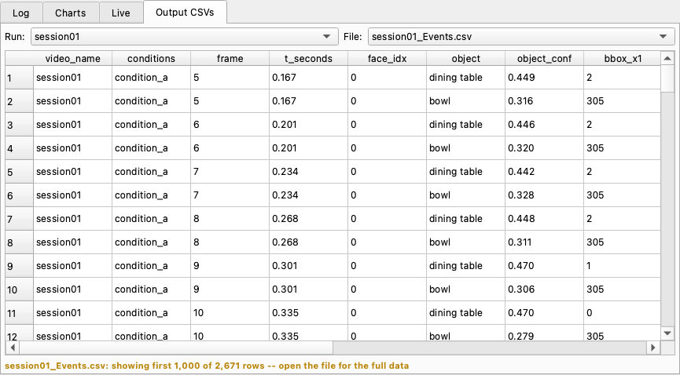

The files themselves live under `Outputs/Runs/<run_id>/` (run-folder projects)
or `Outputs/CSV Files/` (flat projects, and the project-wide `Global_*`
aggregates). The full catalogue -- what each file is and when to use it -- is on
the [Understanding the Outputs](../concepts/outputs.md) page. The short version:

| File | What it is | Hand to analyst? |
|------|-----------|------------------|
| `{stem}_summary.csv` (and `Global_summary.csv`, `By Condition/`) | Aggregated look-time and phenomena metrics | **Yes -- this is the main file** |
| `{stem}_manifest.json` | Provenance: exact config, model hashes, versions | **Yes -- keeps results traceable** |
| `{stem}_Events.csv` (and `Global_Events.csv`) | One row per gaze-object hit per frame | Only if the analysis needs frame-level detail |
| Heatmaps, Charts, annotated video | Visual review aids | No -- for review, not statistics |

**The handoff is usually small:** the **summary CSV** (or the project-mode
`Global_summary.csv` / `By Condition/` files) plus the **manifest JSON** so the
numbers are traceable. When in doubt about which files your study wants, ask your
study lead or the analyst.

---

## 9. Re-run one failed video

If a single recording failed or you fixed its metadata and want just that one
reprocessed, you do not re-run the whole batch. Project runs **resume by
default**: MindSight keeps a ledger of what is already done and skips completed
videos.

- To reprocess **one** recording, right-click its row in the runs table and
  choose **Re-run this run**. The row's status tells you what Run will do to
  it -- *re-run + archive* means the previous output is set aside first, not
  deleted.
- **Run** processes everything that is not already complete.
- **Re-run all** (it asks for confirmation) reprocesses everything from
  scratch, ignoring the ledger; prior outputs are archived. Your study lead can
  tell you when that is warranted.

Because runs resume, an interrupted overnight batch is safe to simply start
again -- it picks up the remaining videos.

---

## 10. Fix a recording: crop and frame rate

If a camera captured more room than the study needs, or a device recorded at an
odd frame rate, use **Crop & Adjust Videos...** on the project overview
(Projects tab). Drag a rectangle over the preview to crop, or set a new frame
rate; queue edits across several videos and apply them in one batch.

Cropping is worth doing: MindSight generally performs best when the footage is
**tightly cropped to the areas that matter to your study**. For a desk task,
that means the participants and the desktop -- crop away the feet, the floor,
and the blank space above their heads. Less irrelevant frame means fewer
spurious detections and more of the resolution spent on faces and objects.

- Edits are **non-destructive by default**: the untouched original is kept in
  an `original/` folder beside the video. (A warned checkbox overwrites
  instead.)
- **Auto-crop** can place the rectangle for you: name the objects that matter
  ("person, dining table") or point it at your study's visual prompt file, and
  it fits the crop around what it finds, plus padding. You always get to review
  and adjust the rectangle before applying. An **Advanced...** toggle picks the
  detector model and sets each side's padding independently (negative padding
  crops inside the detections).
- An edited video is detected automatically on the next **Run** -- its old
  outputs are archived and it reprocesses with the new picture.

---

## Quick analysis without a project

For a fast look at a single recording -- no folders, no metadata -- switch
Analyze Footage to **Video File** mode: browse to the file (or drop it onto
the tab), and press **Analyze**. Live charts fill the left pane while it
processes, and the output folder (prefilled, editable) gets the same CSVs a
project run produces.

**Camera** mode does the same from a webcam: **Refresh** lists your cameras by
name, **Start Camera** records and analyzes live, and **Stop** finalizes the
outputs. The optional **Session details** fields (participants, session,
notes) carry your labels into the output CSVs, so an ad-hoc recording can
still land with proper metadata.

Quick runs use the settings from the **Inference Settings** dialog (the
button is right on the tab) -- fresh installs start on the shipped known-good
preset, so the numbers match a project run out of the box.

---

## Appendix: the other tabs

You will not need these for a routine batch, but here is what they are for.

### Visual prompts (VP Builder)

The known-good preset uses a **YOLOE** open-vocabulary detector, which works best
*with* a visual prompt: a small `.vp.json` file that gives the detector example
boxes of the objects your study cares about. Your study lead usually prepares
this once and drops it in `Inputs/Prompts/`.

If you need to build one, the **VP Builder** tab loads reference images, lets you
name object classes and draw boxes on them, then **Save VP File...**:

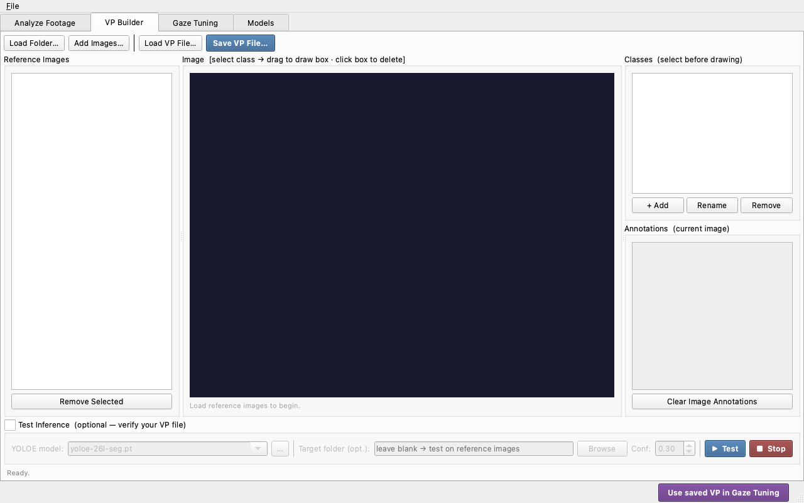

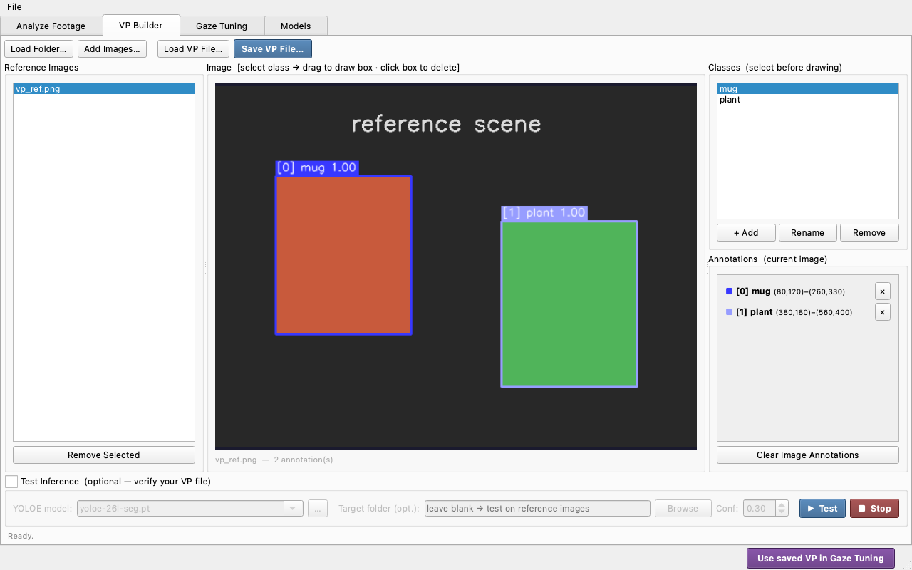

The reference image should match your video's resolution -- YOLOE encodes object
size in pixels. **Extract Frames...** on the toolbar pulls evenly spaced stills
straight out of a video (or out of every video in a project) to use as
reference images.

To share a visual prompt between machines, **Export Portable...** packs the
prompt and its reference images into a single `.vp.zip`; **Load VP File** on the
other machine opens it directly. To use a prompt in your study's runs, set the
**Visual prompt file** in the Inference Settings dialog, or have your study
lead add it to the project's pipeline preset.

### Inference Settings

**Inference Settings...** (a button on every Analyze Footage mode, and under
the Tools menu) is the control panel for how runs launched from Analyze Footage
are processed -- models and compute device, gaze estimation, object detection,
which phenomena are tracked, outputs, and performance, across seven tabs.

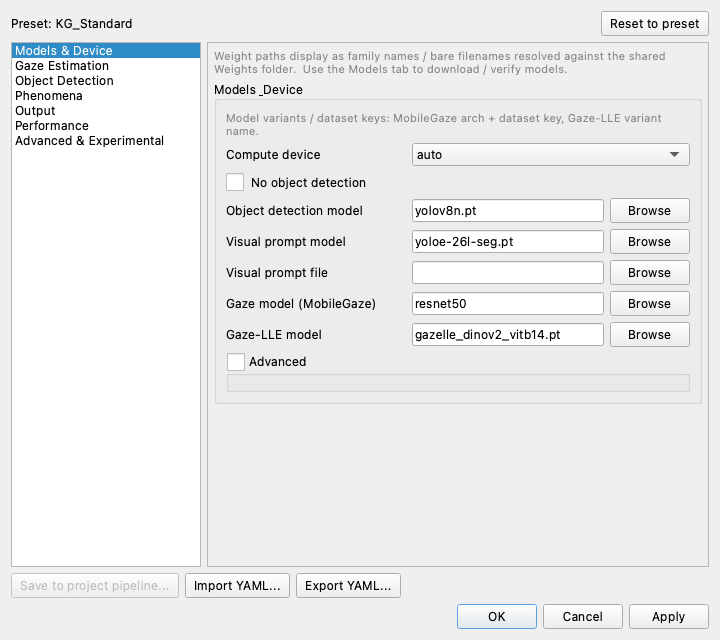

The header shows which preset the settings come from (fresh installs:
**KG_Standard**, the shipped known-good preset) and whether you have modified
it. Values you type can go beyond a slider's usual range -- the value shows
amber instead of being clamped. **Save to project pipeline...** writes the
current settings into the open project's preset so the whole study runs with
them; coordinate with your study lead before changing a running study's
settings.

### Inference Tuning

The **Inference Tuning** tab is an interactive playground: load a clip, watch
the gaze overlay live, and experiment with detector and ray settings to see
their effect immediately. It is the right place to *find* good values -- and
since it is deliberately decoupled from everything else, nothing you try here
changes your study's runs. When an experiment is worth keeping, bring it
across with **Import from Inference Tuning** in the Inference Settings dialog
(or **Import from Inference Tuning** in the Projects tab's Study setup).


### Models

The **Models** tab lists every model weight, whether it is required, present, and
verified against its published checksum. If preflight complains about a weight,
come here to **Verify** or **Re-download** it.

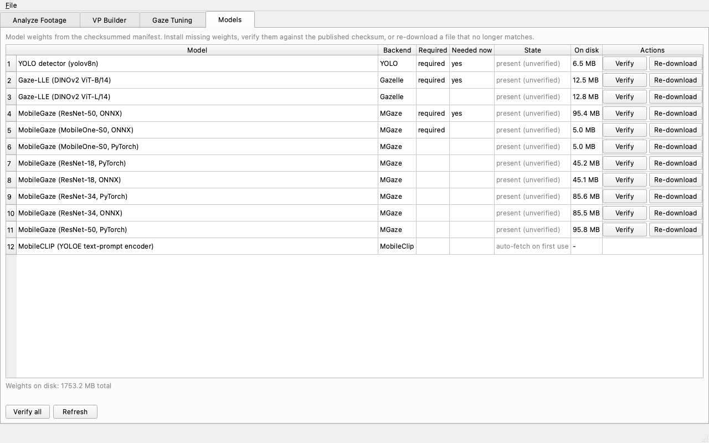

### See also

For each surface above, the GUI Guides cover it in more depth:

- [GUI Tour](../getting-started/quickstart-gui.md) -- a map of the whole window.
- [Projects and sessions](../guides/projects-and-sessions.md) -- building
  projects, planning and recording sessions, run management.
- [Analyze footage](../guides/analyze-footage.md) -- the Project, Video File, and
  Camera modes in depth.
- [Visual prompts](../guides/visual-prompts.md) -- building, tuning, and sharing
  `.vp.json` files.
- [Crop and adjust](../guides/crop-and-adjust.md) -- re-framing recordings and
  auto-crop.
- [Inference settings and tuning](../guides/inference-settings-and-tuning.md) --
  the dialog vs. the tuning tab.
- [About and theming](../guides/about-and-theming.md) -- the in-app reader and
  theme control.
- [Where things live](../guides/where-things-live.md) -- every file on disk.

---

## 11. Troubleshooting: every preflight message

The table below lists every warning or failure message preflight can print,
what it means, and who to go to. Passing (green) checks
are not listed; the table covers only **warnings** (yellow -- usually safe to
proceed) and **failures** (red -- must fix before Run). Placeholders like `{...}`
are filled in with the specific file or value when you see the real message.

| Preflight message | What it means | Severity / who to call |
|-------------------|---------------|------------------------|
| `project directory not found: {path}` | The folder you opened is not there -- wrong path, or an external drive is unmounted. | FAIL. Re-open the correct project folder; remount the drive. |
| `both Inputs/Runs/ and Inputs/Videos/ are populated -- the layout is ambiguous` | The project mixes flat and run-folder layouts; MindSight cannot tell which to use. | FAIL. Keep run folders **or** flat videos, not both. Ask your study lead which layout this study uses. |
| `missing Inputs/Videos/ under {project}` | Flat-layout project has no `Inputs/Videos/` folder to read from. | FAIL. Create `Inputs/Videos/` and add the recordings (or use **Add single run...**). |
| `no pipeline config found; schema defaults will apply` | The project does not point at a pipeline preset, so built-in defaults are used. | WARN. Fine for a quick look; for a real study, set `pipeline:` in `project.yaml` to `configs/pipeline_known_good.yaml`. |
| `{name} invalid: {exc}` | The pipeline YAML has a syntax or value error. | FAIL. The message names the file and the problem; ask your study lead, or fix the pipeline YAML. |
| `no weights configured (auto-download names not resolved)` | No model weight paths are set in the config. | WARN. Usually fine (the preset names them); if detection does nothing, check the config with your study lead. |
| `weight file(s) not found -- {msg}` | A model weight file is missing. The message prints the exact absolute path where each missing file is expected (the shared `Weights/` folder -- weight resolution is global, not per-project). | FAIL. Put the weight at the printed path: the **Models** tab can **Re-download** the standard ones, or run the installer again. |
| `manifest unavailable: {exc}` | The checksum manifest that verifies weights could not be read. | WARN. Reinstall or restore `weights_manifest.json`; weights still load. |
| `{name} differs from the published '{label}' weight` | A weight file does not match its published checksum -- corrupted or altered. | FAIL. **Models** tab > **Re-download** that weight (or `mindsight-weights --force`). |
| `custom weight(s) not in the manifest: {names}` | You are using a weight the manifest does not know about. | WARN. Custom weights are allowed; expected if your lab uses a custom model. |
| `VP-mode detector configured but no .vp.json in Inputs/Prompts/` | The config expects a visual prompt but none is present. | WARN. Add your study's `.vp.json` to `Inputs/Prompts/` (VP Builder), or ask your study lead for it. |
| `{name} is not valid JSON: {exc}` | The visual prompt file is corrupted. | FAIL. Re-export the `.vp.json` from the VP Builder. |
| `{name} has no reference with annotations` | The visual prompt has no annotated reference image. | FAIL. Add an annotated reference in the VP Builder and re-save. |
| `ambiguous layout -- no runs to process` | Layout is ambiguous, so no recordings could be listed. | FAIL. Resolve the flat-vs-run-folder ambiguity (see above). |
| `no run folders found in Inputs/Runs/` | Run-folder project has an empty `Inputs/Runs/`. | FAIL. Add `Inputs/Runs/<run_id>/` folders, each with one video. |
| `all {n} session(s) awaiting recording` | Every session in this project is planned -- it has its `run.yaml` metadata but no footage yet. Nothing can be processed until at least one is recorded or attached. | WARN. Record the sessions live (**⏺ Record Session...**) or right-click each row and **Attach footage...**. |
| `run folder(s) not holding exactly one video: {bad}` | A run folder has several videos, or none *and* no `run.yaml` (a videoless folder **with** a `run.yaml` is a planned session, which is fine). | FAIL. Put exactly one primary video in each named run folder. |
| `output name collision: {names} both write {file}` | Two source recordings would write the same output CSV (e.g. `a.mp4` and `a.mov` both produce `a_Events.csv`), so one would overwrite the other's results. | FAIL. Rename one of the colliding source files. |
| `Inputs/Videos/ is missing -- no runs to process` | Flat project has no videos folder, so nothing to run. | FAIL. Create `Inputs/Videos/` and add recordings. |
| `no video/image sources found in Inputs/Videos/` | The videos folder exists but is empty. | FAIL. Add at least one recording (or use **Add single run...**). |
| `run.yaml problem(s): {errs}` | A run folder's `run.yaml` metadata is invalid. | FAIL. Fix the `run.yaml` as the message describes; ask your study lead if unsure. |
| `unknown run.yaml key(s): {warns}` | A `run.yaml` has keys MindSight does not recognize (likely a typo). | WARN. Use only the known keys (participants, conditions, date, session, notes, extra). |
| `{n}/{m} run(s) without participant labels: {ids}` | Some recordings have no participant map. | WARN. Optional -- MindSight defaults to `P0, P1, ...`. Add labels if your analysis needs named participants. |
| `{n}/{m} run(s) without conditions: {ids}` | Some recordings have no condition tag. | WARN. Optional, but per-condition aggregates need condition tags -- add them if your study uses conditions. |
| `device '{req}' check failed: {exc}` | The requested compute device could not be initialized. | FAIL. Set the device to **auto** or **cpu**; report to your study lead if it persists. |
| `device '{req}' is not available` | The requested device (e.g. a GPU) is not present on this machine. | FAIL. Choose an available device, or **auto** / **cpu**. |
| `could not check free space: {exc}` | MindSight could not read the disk's free space. | WARN. Verify the volume has room manually and proceed. |
| `low disk: {free} GB free < {need} GB (1.5x inputs)` | Not much free space for outputs. | WARN. Free up space, or turn off the annotated video output, before a big batch. |
| `plugin load error(s): {errs}` | An analysis plugin failed to load. | FAIL. Fix or remove the failing plugin; report to your study lead / a developer. |
| `check crashed: {exc}` | A preflight check itself errored -- unexpected. | FAIL. Report this to a developer with the message; it is a bug, not your setup. |

Two behaviors worth knowing alongside the table: the disk-space check only runs
when the annotated video output is enabled (with it off, no extra headroom is
needed), and in **no-object-detection mode** (an Inference Settings option some
studies use) the detector-weight and visual-prompt rows above simply do not
apply -- preflight skips them.

---

## Save this guide as a PDF

To keep an offline copy, print this page to PDF from your browser:

- **macOS** -- **File > Print** (or ⌘P), then in the print dialog choose **Save
  as PDF** from the PDF dropdown (bottom-left) and save.
- **Windows** -- **Ctrl+P**, then choose **Microsoft Print to PDF** (or **Save as
  PDF**) as the printer and save.
- **Chrome / Edge (any OS)** -- **Ctrl/⌘P**, set the destination to **Save as
  PDF**, and save.

A pre-generated PDF of this tutorial,
[`run-a-study-tutorial.pdf`](run-a-study-tutorial.pdf), is committed alongside
this page for convenience.
