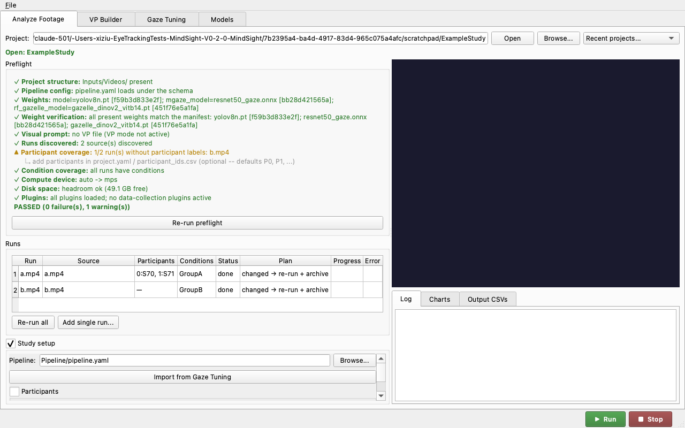
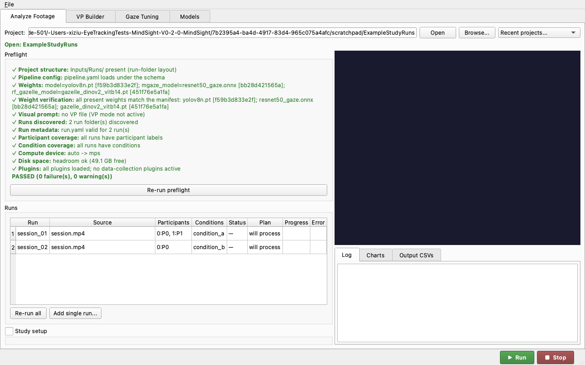
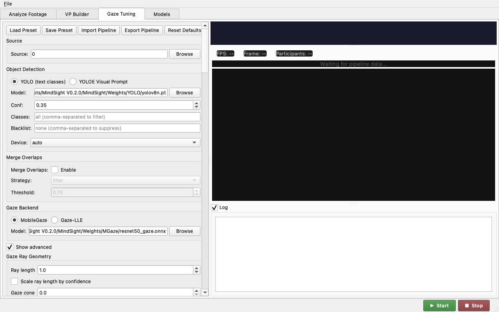

# Run a Study with MindSight

This is a start-to-finish walkthrough for a research assistant who has been
handed a set of recordings and asked to run them through MindSight. It assumes
**no prior experience** with the command line: every step is a click, and the
one or two places where you have to type a command spell it out exactly and show
you what a successful result looks like.

The guide is deliberately generic. Wherever it says *your study* or *your study
lead*, fill in the specifics your lab gave you. The concrete example it points
at is the `Projects/ExampleStudy/` folder that ships with MindSight and the
shipped preset `configs/pipeline_known_good.yaml` -- use them as a reference for
the shape of a real project.

!!! note "What you need before you start"
    - MindSight installed (below).
    - The **study project folder** your study lead prepared, or the videos plus
      the participant/condition scheme to build one.
    - A rough idea of your study's *conditions* (the experimental labels for each
      recording) and *participants* (who is in each recording).

---

## 1. Install MindSight

MindSight ships as a double-click installer that sets up a private Python, all
of MindSight's dependencies, and the four required model weights (about 115 MB).
You do not install Python or anything else first.

=== "macOS"

    1. Download the release zip (for example `MindSight-SP4.0-mac.zip`) from the
       lab's release location. *(Download links go live once the first tagged
       release is published; until then your study lead will hand you the zip.)*
    2. Double-click the zip in Finder to extract it, then move the extracted
       folder somewhere you can find again (Desktop or Downloads is fine).
    3. Open the extracted folder. **Right-click** (or Control-click)
       `Install-MindSight.command` and choose **Open**.
    4. macOS Gatekeeper may warn that the file is from an unidentified developer.
       Because you used **right-click > Open**, the dialog gives you an **Open**
       button -- click it. (A plain double-click only offers *Move to Trash*;
       right-click > Open is how you get past it. This is expected for an
       in-house tool that is not code-signed.)
    5. A Terminal window opens and walks through six steps, printing a line for
       each. Leave it running -- installing dependencies and downloading the
       weights takes several minutes. It finishes with either
       `MindSight install: PASS` or `MindSight install: FAILED at step N`.
    6. Press Return to close the window.

    The installer puts a **MindSight** launcher on your Desktop
    (`MindSight.command`). Double-click it to open the app. The first launch may
    prompt Gatekeeper once more -- use **right-click > Open** that one time.

    Everything lives under `~/MindSight` (your home folder's `MindSight`
    directory). Your results are written inside `~/MindSight/app/Outputs/`.

    *(Screenshots of the macOS Finder / Gatekeeper / Terminal install steps are
    to follow. The wording above matches exactly what you will see.)*

=== "Windows"

    1. Download the release zip (for example `MindSight-SP4.0-win.zip`).
       *(Download links go live once the first tagged release is published.)*
    2. Right-click the zip, choose **Extract All...**, and extract it to a folder
       you can find again.
    3. Open the extracted folder and double-click **`Install-MindSight.bat`**.
    4. Windows may show a blue **"Windows protected your PC"** SmartScreen box
       because the installer is unsigned. Click **More info**, then **Run
       anyway**. (This is expected for an in-house tool.)
    5. A console window walks through seven steps. Leave it running; it finishes
       with `MindSight install: PASS` or `MindSight install: FAILED at step N`.
    6. Press a key to close the window.

    Launch MindSight from the **MindSight** shortcut on your Desktop or Start
    Menu. Everything lives under `%LOCALAPPDATA%\MindSight` (usually
    `C:\Users\<you>\AppData\Local\MindSight`); results land in
    `...\MindSight\app\Outputs\`.

    *(Windows install screenshots are to follow; the SmartScreen wording above is
    exactly what appears.)*

If your lab set you up on a shared lab machine that already has MindSight, skip
this section -- just open the app.

---

## 2. The home screen

When MindSight opens you land on the **Analyze Footage** tab. This is where you
spend almost all of your time: open a project, look at the preflight checklist,
and press **Run**.


The other tabs are for occasional tasks and are covered near the end: **VP
Builder** (make a visual prompt), **Gaze Tuning** (change pipeline settings), and
**Models** (check the model weights).

---

## 3. Open the study project folder

A MindSight *project* is just a folder with a known layout. Your study lead most
likely handed you one already; if so, that folder is your starting point.

At the top of Analyze Footage, click **Browse...** and pick the study project
folder (or paste its path and click **Open**). MindSight remembers recent
projects in the **Recent projects...** menu.

The example project that ships with MindSight, `Projects/ExampleStudy/`, shows
the shape a project takes:

```
ExampleStudy/
├── project.yaml            # points at the pipeline preset; holds participants/conditions
├── Inputs/
│   ├── Videos/             # (flat layout) your recordings go here
│   ├── Runs/               # (run-folder layout) one subfolder per session
│   └── Prompts/            # your study's .vp.json visual prompt, if you use one
└── Outputs/                # created for you when you Run
```

`project.yaml` points at the pipeline preset with a line like
`pipeline: ../../configs/pipeline_known_good.yaml`. That preset,
`configs/pipeline_known_good.yaml`, is MindSight's pre-tuned known-good
configuration: sensible detection, gaze, and **Gaze-LLE Blend** settings
validated on classroom-style footage. You normally do not touch it -- your study
lead has already pointed the project at the right one.

A project uses **one of two layouts** for its recordings:

- **Flat layout** -- videos sit directly in `Inputs/Videos/`. Simplest; good when
  every recording is one participant or a fixed pairing.
- **Run-folder layout** -- each recording session gets its own folder under
  `Inputs/Runs/<run_id>/` holding exactly one video plus an optional `run.yaml`
  with that session's participants and condition. Best when sessions carry
  their own metadata (date, session id, per-run conditions). See
  [section 6](#6-run-folder-projects).

Use whichever layout your study lead set up; do not mix both in one project.

---

## 4. Read the preflight checklist

Every time you open a project (and again whenever you click **Re-run preflight**)
MindSight runs a **preflight** check: a readiness checklist that catches the
common problems *before* you spend hours processing. Green checks are fine,
yellow are warnings you can usually ignore, red are things you must fix.


A healthy project reads **PASSED**, possibly with a warning or two (missing
participant labels and low disk are warnings, not blockers). If preflight shows a
red **FAIL**, do not press Run -- find the row in the
[troubleshooting table](#10-troubleshooting-every-preflight-message) at the
bottom of this page, which explains every preflight message in plain language and
who to call.

Below the checklist, the **Runs** table lists every recording MindSight found,
one row each, with its participants, condition, current status, and what Run will
do to it (process it, or re-run and archive the previous output).

---

## 5. Add videos and fill in participants and conditions

If your project already has its videos and metadata, skim this section and move
to [Run](#7-run-the-analysis). If you are building the project from loose
recordings, this is where you do it.

### Add recordings

Click **Add single run...** to add one recording at a time. Pick the video with
**Browse...**, then fill in the fields:


- **Participants** -- a `track:label` map, e.g. `0:P0, 1:P1`. The number is the
  detected face's tracking id; the label is your name for that person. Leave it
  blank and MindSight defaults to `P0, P1, ...`.
- **Import CSV...** -- if your study keeps a `participant_ids.csv`, load a row
  from it instead of typing.
- **Conditions** -- the experimental condition tag(s) for this recording, e.g.
  `condition_a`. These become a column in the outputs and drive the
  per-condition aggregates.
- **Date / Session / Notes** -- optional bookkeeping.
- **Move original into the project** -- leave unchecked to copy the video in
  (the default, and safest); check it to move the file.

Click **Run now** to process immediately, or **Save to project...** to add it and
run everything later.

### Edit a recording's metadata

To change a recording's participants or condition after adding it, select its row
and use **Edit run...**:


### Study-wide settings

Expand the **Study setup** panel (bottom of Analyze Footage) for settings that
apply to the whole project -- the pipeline preset in use, a project-wide
participant map, and an **Anonymize Footage** toggle that blurs or blacks out
faces in the annotated video and heatmap backgrounds (turn this on if your ethics
protocol requires de-identified outputs).



---

## 6. Run-folder projects

If your study uses the **run-folder** layout, each session lives in its own
folder under `Inputs/Runs/<run_id>/` with exactly one video and an optional
`run.yaml`:

```yaml
# Inputs/Runs/session_01/run.yaml
participants: {0: P0, 1: P1}
conditions: [condition_a]
date: 2026-07-02
session: session-01
```

MindSight discovers each run folder, reads its `run.yaml`, and lists it in the
runs table by run id. Outputs for run-folder projects are gathered under
`Outputs/Runs/<run_id>/`.



The rest of the workflow -- preflight, Run, outputs -- is identical to the flat
layout.

---

## 7. Run the analysis

When preflight passes and the runs table looks right, press the green **Run**
button (bottom right). MindSight processes each recording in turn.

**What normal progress looks like.** The **Log** panel on the right prints a
line-by-line trace: it loads the models (you will see the **MobileGaze** gaze
backend and the **Gaze-LLE** scene model come up), then reports per-frame
progress, then a `Done` line per video with the frame count and how many
gaze-object hit events it recorded. The **Progress** column in the runs table
fills as each video completes.

**How long it takes.** Processing is roughly real-time-ish to a few times slower
than real-time per video, heavily dependent on the machine and whether the
annotated video is being rendered (rendering is the slowest output by far). As a
rough anchor, a short clip runs in a few minutes on Apple Silicon; a full
30-minute session can take substantially longer, especially on a CPU-only
machine. **Treat a full study batch as an overnight job**: start it at the end of
the day, leave the machine awake and plugged in, and check it in the morning. If
it is interrupted, MindSight resumes where it left off (see
[section 9](#9-re-run-one-failed-video)) -- you will not lose completed work.

You can press **Stop** to halt after the current frame; already-completed videos
keep their outputs.

---

## 8. Outputs and what to hand the analyst

When a batch finishes, its results are under the project's `Outputs/` folder. You
can inspect them without leaving the app:

- The **Charts** tab (in the output panel, bottom right) shows the phenomena
  charts for a selected run -- a quick visual sanity check.

  

- The **Output CSVs** tab is a read-only viewer over the run's event and summary
  CSVs.

  

The files themselves live under `Outputs/CSV Files/` (flat projects) or
`Outputs/Runs/<run_id>/` (run-folder projects). The full catalogue -- what each
file is and when to use it -- is on the
[Understanding the Outputs](../concepts/outputs.md) page. The short version:

| File | What it is | Hand to analyst? |
|------|-----------|------------------|
| `{stem}_summary.csv` (and `Global_Summary.csv`, `By Condition/`) | Aggregated look-time and phenomena metrics | **Yes -- this is the main file** |
| `{stem}_manifest.json` | Provenance: exact config, model hashes, versions | **Yes -- keeps results traceable** |
| `{stem}_Events.csv` (and `Global_Events.csv`) | One row per gaze-object hit per frame | Only if the analysis needs frame-level detail |
| Heatmaps, Charts, annotated video | Visual review aids | No -- for review, not statistics |

**The handoff is usually small:** the **summary CSV** (or the project-mode
`Global_Summary.csv` / `By Condition/` files) plus the **manifest JSON** so the
numbers are traceable. When in doubt about which files your study wants, ask your
study lead or the analyst.

---

## 9. Re-run one failed video

If a single recording failed or you fixed its metadata and want just that one
reprocessed, you do not re-run the whole batch. Project runs **resume by
default**: MindSight keeps a ledger of what is already done and skips completed
videos.

- To reprocess **one** recording, select its row in the runs table and use the
  per-row re-run control (the row's status shows what Run will do to it -- e.g.
  *re-run + archive*, meaning the old output is set aside first).
- **Run all** reprocesses everything that is not already complete.
- To force a full reprocess from scratch, use **Re-run all** after clearing the
  prior outputs (your study lead can tell you when that is warranted).

Because runs resume, an interrupted overnight batch is safe to simply start
again -- it picks up the remaining videos.

---

## Appendix: the other tabs

You will not need these for a routine batch, but here is what they are for.

### Visual prompts (VP Builder)

The known-good preset uses a **YOLOE** open-vocabulary detector, which works best
*with* a visual prompt: a small `.vp.json` file that shows the detector example
boxes of the objects your study cares about. Your study lead usually prepares
this once and drops it in `Inputs/Prompts/`.

If you need to build one, the **VP Builder** tab loads reference images, lets you
name object classes and draw boxes on them, then **Save VP File...**:


The reference image's resolution should match your video -- YOLOE encodes pixel
size. Once saved, use **Use saved VP in Gaze Tuning** to wire it into the
pipeline.

### Gaze Tuning

The **Gaze Tuning** tab exposes the pipeline settings -- detector, confidence,
the **MobileGaze** / **Gaze-LLE** gaze backends, ray geometry -- with a **Show
advanced** toggle for the deeper parameters. For a study running the shipped
preset you should not need to touch this; changing values here can alter your
results, so coordinate with your study lead first.




### Models

The **Models** tab lists every model weight, whether it is required, present, and
verified against its published checksum. If preflight complains about a weight,
come here to **Verify** or **Re-download** it.


---

## 10. Troubleshooting: every preflight message

Preflight groups its checks into eleven areas. The table below lists every
message it can print, what it means, and who to go to. **Green** rows never
appear as problems; only **warnings** (yellow, usually safe to proceed) and
**failures** (red, must fix before Run) are listed. Placeholders like `{...}`
are filled in with the specific file or value when you see the real message.

| Preflight message | What it means | Severity / who to call |
|-------------------|---------------|------------------------|
| `project directory not found: {path}` | The folder you opened is not there -- wrong path, or an external drive is unmounted. | FAIL. Re-open the correct project folder; remount the drive. |
| `both Inputs/Runs/ and Inputs/Videos/ are populated -- the layout is ambiguous` | The project mixes flat and run-folder layouts; MindSight cannot tell which to use. | FAIL. Keep run folders **or** flat videos, not both. Ask your study lead which layout this study uses. |
| `missing Inputs/Videos/ under {project}` | Flat-layout project has no `Inputs/Videos/` folder to read from. | FAIL. Create `Inputs/Videos/` and add the recordings (or use **Add single run...**). |
| `no pipeline config found; schema defaults will apply` | The project does not point at a pipeline preset, so built-in defaults are used. | WARN. Fine for a quick look; for a real study, set `pipeline:` in `project.yaml` to `configs/pipeline_known_good.yaml`. |
| `{name} invalid: {exc}` | The pipeline YAML has a syntax or value error. | FAIL. The message names the file and the problem; ask your study lead, or fix the pipeline YAML. |
| `no weights configured (auto-download names not resolved)` | No model weight paths are set in the config. | WARN. Usually fine (the preset names them); if detection does nothing, check the config with your study lead. |
| `weight file(s) not found -- {msg}` | A model weight file is missing from `Weights/`. | FAIL. Open the **Models** tab and **Re-download** the missing weight (or run the installer again). |
| `manifest unavailable: {exc}` | The checksum manifest that verifies weights could not be read. | WARN. Reinstall or restore `weights_manifest.json`; weights still load. |
| `{name} differs from the published '{label}' weight` | A weight file does not match its published checksum -- corrupted or altered. | FAIL. **Models** tab > **Re-download** that weight (or `mindsight-weights --force`). |
| `custom weight(s) not in the manifest: {names}` | You are using a weight the manifest does not know about. | WARN. Custom weights are allowed; expected if your lab uses a custom model. |
| `VP-mode detector configured but no .vp.json in Inputs/Prompts/` | The config expects a visual prompt but none is present. | WARN. Add your study's `.vp.json` to `Inputs/Prompts/` (VP Builder), or ask your study lead for it. |
| `{name} is not valid JSON: {exc}` | The visual prompt file is corrupted. | FAIL. Re-export the `.vp.json` from the VP Builder. |
| `{name} has no reference with annotations` | The visual prompt has no annotated reference image. | FAIL. Add an annotated reference in the VP Builder and re-save. |
| `ambiguous layout -- no runs to process` | Layout is ambiguous, so no recordings could be listed. | FAIL. Resolve the flat-vs-run-folder ambiguity (see above). |
| `no run folders found in Inputs/Runs/` | Run-folder project has an empty `Inputs/Runs/`. | FAIL. Add `Inputs/Runs/<run_id>/` folders, each with one video. |
| `run folder(s) not holding exactly one video: {bad}` | A run folder has zero or several videos. | FAIL. Put exactly one primary video in each named run folder. |
| `Inputs/Videos/ is missing -- no runs to process` | Flat project has no videos folder, so nothing to run. | FAIL. Create `Inputs/Videos/` and add recordings. |
| `no video/image sources found in Inputs/Videos/` | The videos folder exists but is empty. | FAIL. Add at least one recording (or use **Add single run...**). |
| `run.yaml problem(s): {errs}` | A run folder's `run.yaml` metadata is invalid. | FAIL. Fix the `run.yaml` as the message describes; ask your study lead if unsure. |
| `unknown run.yaml key(s): {warns}` | A `run.yaml` has keys MindSight does not recognize (likely a typo). | WARN. Use only the known keys (participants, conditions, date, session, notes). |
| `{n}/{m} run(s) without participant labels: {ids}` | Some recordings have no participant map. | WARN. Optional -- MindSight defaults to `P0, P1, ...`. Add labels if your analysis needs named participants. |
| `{n}/{m} run(s) without conditions: {ids}` | Some recordings have no condition tag. | WARN. Optional, but per-condition aggregates need condition tags -- add them if your study uses conditions. |
| `device '{req}' check failed: {exc}` | The requested compute device could not be initialized. | FAIL. Set the device to **auto** or **cpu**; report to your study lead if it persists. |
| `device '{req}' is not available` | The requested device (e.g. a GPU) is not present on this machine. | FAIL. Choose an available device, or **auto** / **cpu**. |
| `could not check free space: {exc}` | MindSight could not read the disk's free space. | WARN. Verify the volume has room manually and proceed. |
| `low disk: {free} GB free < {need} GB (1.5x inputs)` | Not much free space for outputs. | WARN. Free up space, or turn off the annotated video output, before a big batch. |
| `plugin load error(s): {errs}` | An analysis plugin failed to load. | FAIL. Fix or remove the failing plugin; report to your study lead / a developer. |
| `check crashed: {exc}` | A preflight check itself errored -- unexpected. | FAIL. Report this to a developer with the message; it is a bug, not your setup. |

---

## Save this guide as a PDF

To keep an offline copy, print this page to PDF from your browser:

- **macOS** -- **File > Print** (or ⌘P), then in the print dialog choose **Save
  as PDF** from the PDF dropdown (bottom-left) and save.
- **Windows** -- **Ctrl+P**, then choose **Microsoft Print to PDF** (or **Save as
  PDF**) as the printer and save.
- **Chrome / Edge (any OS)** -- **Ctrl/⌘P**, set the destination to **Save as
  PDF**, and save.

A pre-generated PDF of this tutorial,
[`run-a-study-tutorial.pdf`](run-a-study-tutorial.pdf), is committed alongside
this page for convenience.
